# Gateway firmware
A good deal of information can be found online on Tesla's vehicle gateway.
The best starting point has to be [Keen lab's 2016 presentation on gateway internals](https://2016.zeronights.ru/wp-content/uploads/2016/12/Gateway_Internals_of_Tesla_Motors_v6.pdf).
There is enough information in there to quickly get a Ghidra project up and going at the correct offsets.
By following the code path from the reset vector, one can quickly find the registration of **mainTask**, which in turn registers most of the running Tasks in [FreeRTOS](https://www.freertos.org/a00125.html):

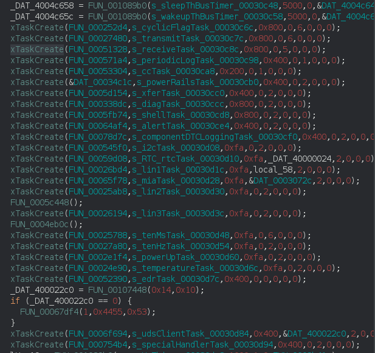

The **periodicLogTask** is the one we are interested in.
It first does some initialization, referencing the **/log** directory, and creating the **logEmptyQueueTask**`.
There are several print statements for debugging, which are helpful in reverse engineering. 
For instance:
- *Unable to queue signal record*
- *Unable to queue time log message*
  
The main endless loop (the way most periodic RTOS tasks are implemented) of the function contains these print statements:
- *Unable to queue aggregate descriptor with id=%d* 
- *Unable to queue aggregate record %d message*

This is where we adopted the naming from, as mentioned earlier. 
These print statements already conceptually can be tied to patterns observed earlier in the raw log data.
The actual reverse engineering of the functions is slightly more involed though, which we will not completely cover.
We will however, touch on some highlights.

The **periodicLogTask**, as its name suggests, periodically enqueues the aggregate records.
Queues are the mechanism in which the FreeRTOS tasks communicate, but also the way they implement mutexes and semaphores.
Another task; **logEmptyQueueTask** unsurprisingly, is in charge of emptying the queue, and writing the records into *log entries* (creating the TLV structure etc.) to the log files.
This **logEmptyQueueTask** is a non-trivial function that contains a switch-case construct, based on the type of record.
Some of these types are linked to the timekeeping signal ID's (0xd00007de, 0xd00007dd) discovered earlier:

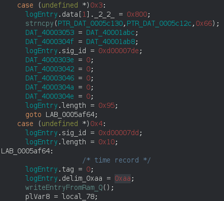

Other types are used for the periodic aggregate descriptors and aggregate records, but are unfortunately too complex to show here.
By analyzing the functions connected to these two main logging tasks, we get confirmation on the TLV log entry structure.
Also, closer inspection of the functions that finalize the log entries before writing them reveal we missed a detail in the way the rolling timestamps are used:

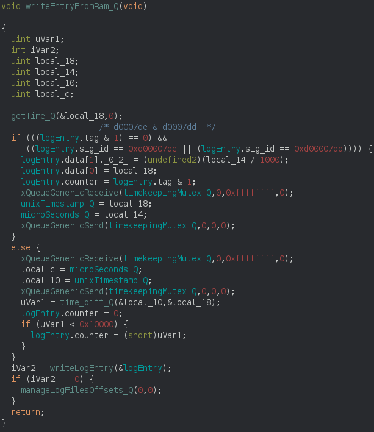

We initially only used the 4 byte Unix timestamp portion of the payload, but the following 2 bytes actually contain the accompanying milliseconds value.
Manual inspection of the log files on portions where records for signal ID's 0xd00007de and 0xd00007dd are in proximity of each other confirmed this behaviour.
Between them the millisecond value in the timestamp increases by about  the amount of the previous record's counter value, just as expected.

## Log signal ID's
At this stage, we can only extract signal timeseries data from the logs. 
The actual value however is in interpreting these signals correctly.
For  this, we need to dig down further in the use of the signal ID's in the firmware.
We'll try to describe the main concepts with sufficient level of detail, and skip specifics where it could be distracting.

The full picture of the data flow requires some analysis from 2 directions:
- Analyze the functions that handle incoming CAN data, which are easily spotted by looking for cross-references on the CAN peripherals using the gateway [documentation](https://www.nxp.com/products/processors-and-microcontrollers/power-architecture/mpc5xxx-microcontrollers/ultra-reliable-mpc56xx-mcus/ultra-reliable-mpc5668g-mcu-for-automotive-industrial-gateway-applications:MPC5668G?tab=Documentation_Tab)
- Analyze the **logEmptyQueueTask**
  
Both have their own data structures in which they keep track of things.

### CAN handlers
Each CAN bus (including the virtual ETH bus) has a base data structure which is used to handle CAN messages.
This structure is kept in RAM, but in a section which is initialized with data from flash when the gateway boots.
In the firmware we analyzed, the structures were associated with the appropriate CAN interrupt handlers just before creating the **mainTask**:

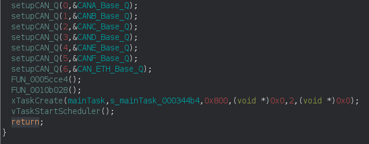

For reference, the sequence of task creations pictured earlier is located inside this main task.
The **vTaskStartScheduler** call is what actually starts the RTOS.

The CAN interrupt handlers use a simple lookup table (*arb_id2internal* below) in the base object to map CAN arbitration ID's to an index into an array of CAN message data structures.

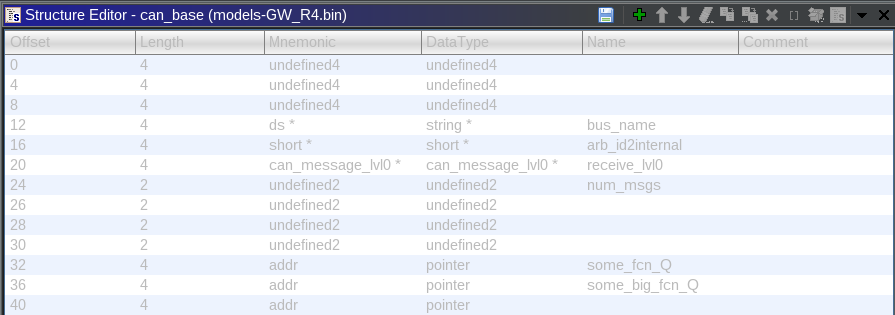

This array of *can_message_lvl0* structures contain CAN message specific information.
Its content is mostly unknown, it seems to also contain the period in milliseconds at which the message should be sent.

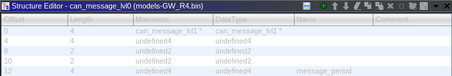

Its first field however, points to yet another structure (*can_message_lvl1*) which has the relevant information we're after (also with plenty of fields that are unknown for now).

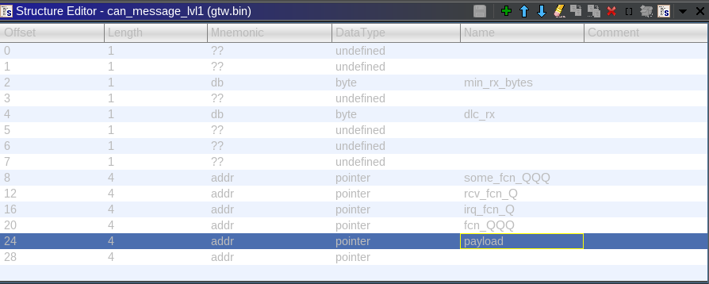

These structures contain values and flags such as callbacks on reception, whether the message needs to be forwarded onto the Ethernet interface, etc.
It also contains a pointer to a global offset in RAM at which the full 8-byte payload of the most recent message should be stored.
Note that each CAN bus of course has its own instance of the mentioned base structure and subsequent substructures.

### Log handlers
The **logEmptyQueueTask** has its own data structure for different aggregate id's, the signals they contain and the logging periodicity.
Eventually, these data structures point to values that turn out to be the log signal ID's we see in the log files (the 0xd00XXXXX values).
These log signal ID's actually are the first field in a data structure for each logged signal.
The structure also contains a pointer to a *can_message_lvl0* data structure used by the CAN message handlers.
Also, they contain pointers to 2 functions in code flash.
These data structures actually are stored in a large array, which can be visualised in the firmware binary:

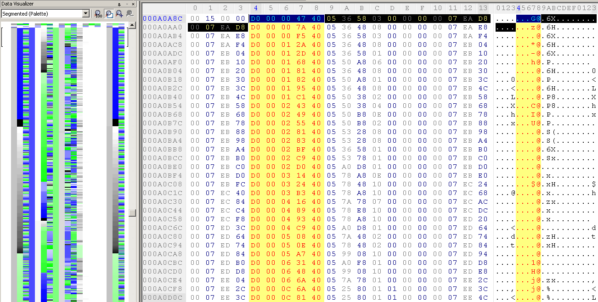

We used [HexWorkshop](http://www.hexworkshop.com/) because of its nice data visualizer which quickly reveals patterns (especially powerful when combined with manually adjusting the number of columns).
It also allows for quick searching with nibble wildcards, in the picture above we used the hex sequence: 0xd00?????40.
This sequence will hit each signal ID which has an address in RAM directly after it.
The address in RAM is actually the pointer to the *can_message_lvl0* data structure.
Highlighted in black is a single structure.
The mentioned data structure is shown below:

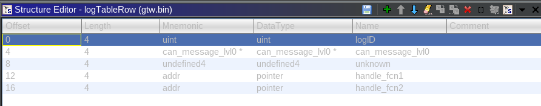

This data structure is the key to decoding the logged signals.
The *can_message_lvl0* structure, when followed, will lead to a CAN message payload buffer in RAM.
The two handle functions turn out to be very short functions which take data from a global offset inside the CAN message payload buffer, extract certain bits from it, and return the result.
Of course this pattern is reminiscent of CAN signal extraction from a message.
We'll try to show this link between signals from CAN messages and log signal ID's by taking an example CAN signal and identifying its ID in the log.

## Example
The definition of CAN messages is usually kept secret by OEMs, but certain values can easily be reverse-engineered with some effort and/or proper tooling.
Some of these reverse-engineering efforts have been shared in the de-facto standard file format: a **.dbc** by comma.ai on their [openDBC repository](https://github.com/commaai/opendbc/blob/master/tesla_can.dbc).
Note that this dbc is already quite dated, and Tesla often changes their CAN message structure and arbitration ID's since they design most of the hardware themselves.
The hardware that they purchase from Tier 1 suppliers however, is less likely to change message identifiers.
For this reason, we'll look at the Steering Wheel Angle measured by the EPAS module (Electric Power Assisted Steering) in this example.
In the DBC snippet below (using [Kvaser Database Editor](https://www.kvaser.com/download/)), we've highlighted the *InternalSAS* (Steering Angle Sensor) signal.

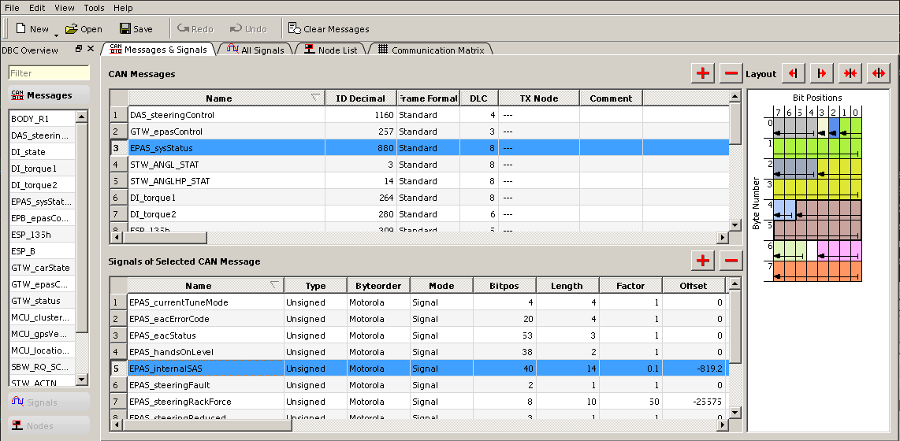

You'll notice its decimal message arbitration ID is 880. 
We can then go through the data structures of each CAN bus attached to the gateway.
Specifically, we're looking at the lookup tables indexed by arbitration id. 
If the table contains a non-zero value, we can use that value to index into the *can_message_lvl0* table to get to that message's data structure.
For this particular CAN message and firmware version, this is true for FlexCAN interface F:

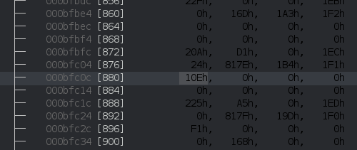

In this case, we'll index into the next lookup table with the value 0x10e (decimal 270), to reach the message's data structure:

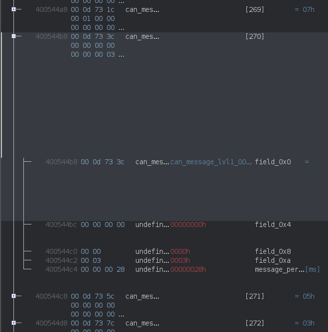

The message period of 0x28 = 40ms (25Hz) actually matches CAN logs we made on a Model S vehicle.
Now we follow the first field to the next data structure that contains the global payload offset that contains this message's data: 0x40007360.

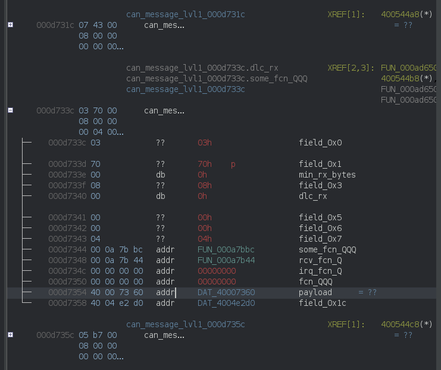

Now to find the matching log signal ID structure; we'll look for the entry containing a pointer to the message structure: 0x400544b8:

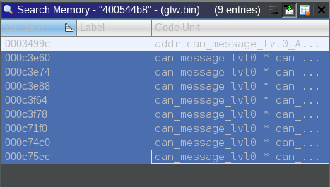

We actually find 8 hits in the array of log signal ID's, which are likely to be other signals from the same message that also get logged. 
It's trivial to check each hit's function pointers to confirm it's extracting the correct bits for the InternalSAS signal.
We eventually find our candidate: signal ID 0xd00256e6.

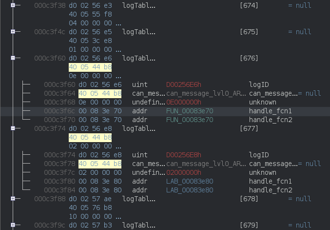

Here's the signal extraction function:

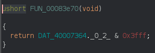

Recall that the message's global data offset was 0x40007360.
This extractor function takes the data from offset 0x40007364 (4 bytes into the data).
It then takes the first two bytes (Ghidra's ._x_y notation where x is startbyte, and y is number of bytes) and masks it with 0x3fff.
Now have a look again at the DBC signal visualisation to see that it matches the InternalSAS signal we were looking for:


Let's visualize the signal EPAS internalSAS (signal ID: 0xd00256e6) after applying the correct scaling (0.1) and offset  (-819.2) from the dbc.
For context, we've also plotted the vehicle speed (signal ID: 0xd0021161) which was found using the same process as described above but for the DI vehicleSpeed signal (DI is Tesla's Drive Inverter).
Keep in mind this is an arbitrary section of a log of about 35 minutes.

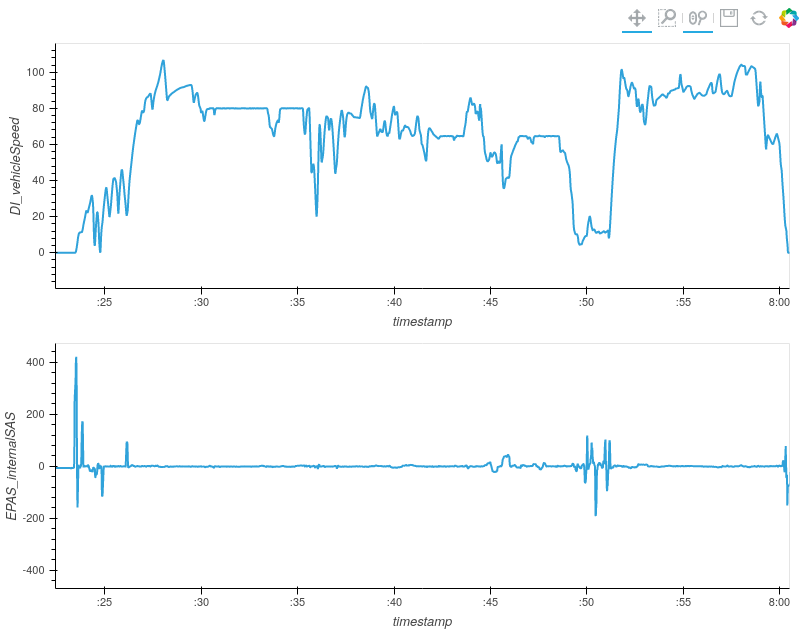

The signals seem plausible; vehicle speed behaves as expected, even exhibiting cruise-control behaviour at some points, and returns to zero when stationary.
Also, the steering wheel angle is usually close to zero for higher speeds and has both positive and negative deflections at lower speeds.
The steering wheel angele's value caps out at about 400 degrees positive and negative, which is a little over 1 full turn to lock, matching a Model S.

## Validation
We were able to record CAN logs on a reference Model S vehicle, and afterwards copy the gateway SD card.
After correcting for a fixed time difference of about 0.5 seconds between the CAN logging host machine's clock and the gateway clock, we can show how the gateway samples the most recent signal value periodically and stores them in the logs.

Overview:

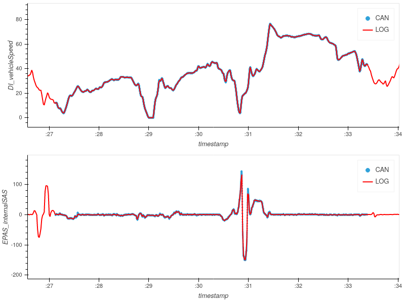

Zoomed in:

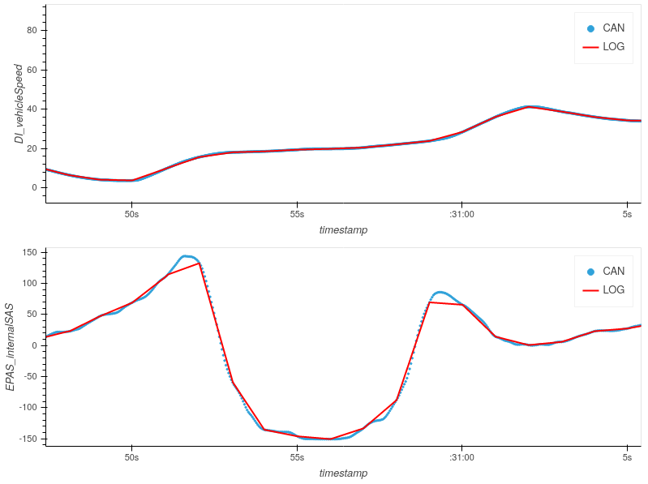

## Automation
We can automate the process we described in the example for each bus, if we know the dbc.
For this we could use the comma.ai version, but a more complete set of signals can be found for example in the 2018.20 mcu2 squashfs firmware image.
In this squashfs firmware, there are .json files at: `/opt/odin/data/ModelS/dej/ModelS_<busname>.compact.json`.
These files are equivalent to dbc files, just formatted differently.
These json files contain detailed information about CAN messages and signals, but are partially outdated now.
From what we could tell by looking at gtw logs from different vehicles though, the match between log signal ID and CAN signal definition seems to remain, even if the CAN message arbitration ID changes.

We created a Python script, see [the matcher script](../teslalogs/model_sx/gtw_signal_map.py), to do the automated matching of log signal ID's to CAN signals.
We will supply the results of this script when run on the 2018.20 firmware.
This is a very version-specific process, and requires some manual configuration by the user, which we'll highlight below.

### Configuration
Each gtw firmware image has a known base address to load at, but the initialized data section will of course vary.
The initialization of the data section can be found at the very beginning of each firmware image, here's an example starting at offset 0x20204:

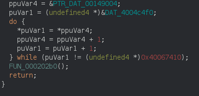

For different versions, these values are likely different, but the structure should be similar.
In the script we've named these values such that they should make immediate sense when observing the decompiled code above:
```python
COPY_FLASH_START = 0x149004
COPY_RAM_START = 0x4004c4f0
COPY_RAM_END = 0x40067410
```
We also need the offset at which the CAN base data structures are located.
These can be easily identified by looking for a repeated function call with incrementing first arguments (the bus id).
The second argument is the offset of the *can_base* object.
In the firmware images we analyzed, these were contiguous in flash, so we only need the offset of the first one:

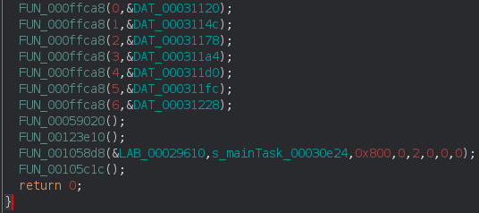

```python
CAN_BASES = 0x31120
```
Note that this is the same portion of code as shown earlier where the mainTask was registered, but showing the actual offsets.

The position of the array of log ID structures is easily spotted by looking for equidistant log ID's with the correct structure size, so we don't need a hardcoded value.
After loading in all the required dbc's and data structures, we can perform the matching.
For this, we used a [fork](https://github.com/simigo79/unicorn-ppc) of the [unicorn-engine](https://www.unicorn-engine.org/) that supports emulating powerpc code.

The algorithm we used is straightforward; 
First build a data structure for each CAN bus id mapping arbitration id's to *can_msg_lvl0* offsets, if they occur in the *arbid2internal* array.
Then we go over each log ID; if we have a matching CAN message in our DBC's, we continue.
We then brute force each signal in the message through the extracting function by setting all signal bits to 1 and checking if exactly those bits are returned by the function.
If this is the case, we record this as a match.

There are 2 function pointers for each log ID, which usually are the same, but not always.
When they are not the same, they seem to extract the same signal bits, but they are returned in different endianness.
We use the first function pointer of each log ID, as this is the endianness that matches the decoded log.
