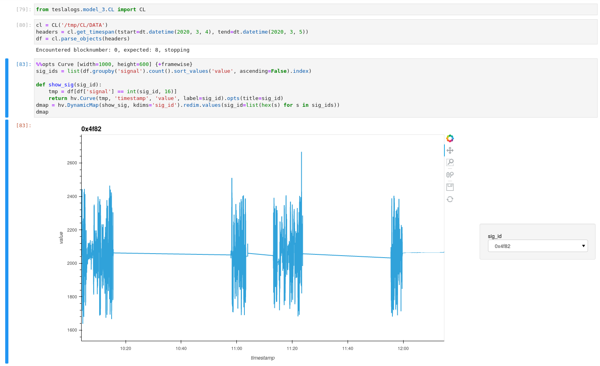
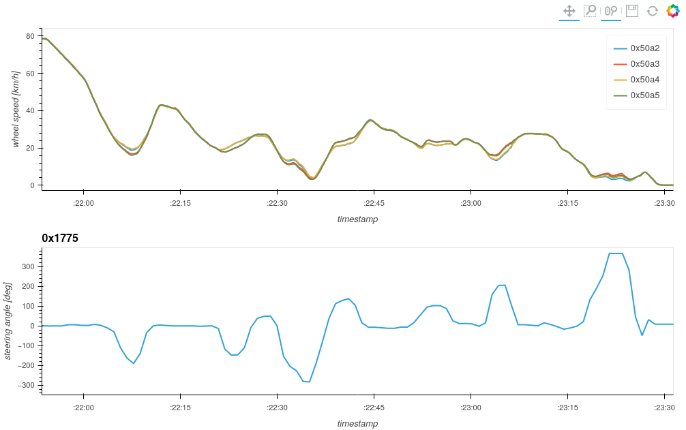

# CL
In more recent investigations of Tesla Model 3 vehicles, we noticed a change in the logging structure.

```bash
➜  SD ls -lh
total 2.3M
-rwxr-xr-x 1 root root  23K Apr 19  2019 0023
-rwxr-xr-x 1 root root  23K Apr 19  2019 0024
-rwxr-xr-x 1 root root  89K Feb  1 14:29 0029
-rwxr-xr-x 1 root root  93K Feb  1 14:29 002A
-rwxr-xr-x 1 root root 222K Feb  1 14:29 BOOTED.IMG
-rwxr-xr-x 1 root root  748 Feb  1 14:29 CBREAKER.MAP
drwxr-xr-x 3 root root  32K Dec 13 10:00 CL
-rwxr-xr-x 1 root root   32 Feb 22  2019 FW3TEST
-rwxr-xr-x 1 root root 640K Jan 12 17:09 GAMEMODE.HRL
-rwxr-xr-x 1 root root  86K Feb 22  2019 GW.HGZ
drwxr-xr-x 2 root root  32K Feb 22  2019 HRL
drwxr-xr-x 2 root root  32K Feb 22  2019 LOG
-rwxr-xr-x 1 root root 536K Mar  4 13:28 LOG.DBG
-rwxr-xr-x 1 root root 100K Feb  1 14:29 MAP.TSV
-rwxr-xr-x 1 root root    0 Jan 21  2019 MFGTEST
-rwxr-xr-x 1 root root 5.0K Feb  1 14:41 MODINFO.LOG
-rwxr-xr-x 1 root root    0 Jan  1  1980 PMIC.TXT
-rwxr-xr-x 1 root root  60K Feb  1 14:47 SWITCH.DMP
-rwxr-xr-x 1 root root 111K Feb  1 14:41 UDSDEBUG.LOG
drwxr-xr-x 2 root root  32K Feb 22  2019 UPDT
```

We see that the LOG and HRL directories are present, but the LOG files only contain data up to December 2019.
A new directory: CL is also present.

```bash
➜  SD tree CL
CL
├── DATA
│   ├── 0.CLB
│   ├── 0.CLH
│   ├── 1.CLB
│   ├── 1.CLH
│   ├── 2.CLB
│   ├── 2.CLH
│   ├── 3.CLB
│   ├── 3.CLH
│   ├── 4.CLB
│   └── 4.CLH
└── LOGIDX.TXT
 
1 directory, 11 files
➜  SD cat CL/LOGIDX.TXT
4
➜  SD ls -lh CL/DATA
total 293M
-rwxr-xr-x 1 root root  43M Dec 26 14:23 0.CLB
-rwxr-xr-x 1 root root  15K Dec 26 14:23 0.CLH
-rwxr-xr-x 1 root root  28M Jan  3 23:17 1.CLB
-rwxr-xr-x 1 root root 9.2K Jan  3 23:17 1.CLH
-rwxr-xr-x 1 root root 103M Jan 27 20:53 2.CLB
-rwxr-xr-x 1 root root  33K Jan 27 20:53 2.CLH
-rwxr-xr-x 1 root root  22M Feb  1 14:29 3.CLB
-rwxr-xr-x 1 root root 6.8K Feb  1 14:29 3.CLH
-rwxr-xr-x 1 root root 100M Mar  4 13:28 4.CLB
-rwxr-xr-x 1 root root  34K Mar  4 13:28 4.CLH
```

The LOGIDX.TXT file file appears to be pointing to the most recent log file, similar to LOGINFO.TXT for the regular LOG files.
But now there are 2 files, with a number as filename with different extensions; .CLH and .CLB.
They all seem to be of different sizes too, which differs from the logs we've seen before.
The CLH files are much smaller than the accompanying CLB files. 

Let's take a look at 0.CLB:


The file does not resemble any of the gateway log files we've encountered so far.
It does not contain fixed size entries, but fortunately it is not encrypted, there are far too many zero bytes for that.
The likely explanation is that Tesla engineers thought of yet another proprieatary compression scheme.
Let's take a look at 0.CLH now:


This file definitely contains some structure, which is actually not that hard to decode by visual inspection.
There are 2 rows of 32 bytes forming some sort of header, followed by rows of 32 bytes long. 
In each row, the first 4 bytes are fixed values: 0xBADDCAFE, probably a signature/magic value. 
Next are 3 bytes 0x00, followed by a sequence of 32-bit integers, with a single 0x00 byte at the end of the row.
Let's decode them as such in a simple IPython snippet:

```python
In [1]: data = open('CL/DATA/0.CLH','rb').read()
In [2]: import struct   
In [3]: for idx in range(0x40, len(data), 0x20):                             
   ...:     row = data[idx:idx+0x20]                                         
   ...:     print(struct.unpack('>4s3xIIIIIIx',row))                         
   ...:                                                                      
(b'\xba\xdd\xca\xfe', 95914, 1576227643, 1576228544, 0, 0, 95914)   
(b'\xba\xdd\xca\xfe', 88648, 1576228544, 1576229445, 1, 95914, 184562)      
(b'\xba\xdd\xca\xfe', 85784, 1576229445, 1576230350, 2, 184562, 270346)      
(b'\xba\xdd\xca\xfe', 86766, 1576230350, 1576231255, 3, 270346, 357112)      
(b'\xba\xdd\xca\xfe', 87414, 1576231255, 1576232160, 4, 357112, 444526)      
(b'\xba\xdd\xca\xfe', 86075, 1576232160, 1576233065, 5, 444526, 530601)      
(b'\xba\xdd\xca\xfe', 90361, 1576233066, 1576233971, 6, 530601, 620962)      
(b'\xba\xdd\xca\xfe', 92082, 1576233971, 1576234876, 7, 620962, 713044)      
(b'\xba\xdd\xca\xfe', 90136, 1576234876, 1576235781, 8, 713044, 803180)      
(b'\xba\xdd\xca\xfe', 87504, 1576235781, 1576236686, 9, 803180, 890684)      
(b'\xba\xdd\xca\xfe', 88206, 1576236686, 1576237587, 10, 890684, 978890)     
(b'\xba\xdd\xca\xfe', 91585, 1576237587, 1576238492, 11, 978890, 1070475)    
(b'\xba\xdd\xca\xfe', 93122, 1576238492, 1576239397, 12, 1070475, 1163597)   
(b'\xba\xdd\xca\xfe', 88594, 1576239397, 1576240302, 13, 1163597, 1252191)   
(b'\xba\xdd\xca\xfe', 61396, 1576240303, 1576256815, 14, 1252191, 1313587)   
(b'\xba\xdd\xca\xfe', 122917, 1576256815, 1576257696, 15, 1313587, 1436504)  
(b'\xba\xdd\xca\xfe', 124914, 1576257696, 1576257901, 16, 1436504, 1561418)  
(b'\xba\xdd\xca\xfe', 123582, 1576257901, 1576258111, 17, 1561418, 1685000)  
(b'\xba\xdd\xca\xfe', 123118, 1576258111, 1576258341, 18, 1685000, 1808118)  
(b'\xba\xdd\xca\xfe', 123095, 1576258341, 1576258566, 19, 1808118, 1931213)  
(b'\xba\xdd\xca\xfe', 123296, 1576258566, 1576258771, 20, 1931213, 2054509)  
(b'\xba\xdd\xca\xfe', 124844, 1576258771, 1576258991, 21, 2054509, 2179353)  
(b'\xba\xdd\xca\xfe', 124956, 1576258991, 1576259221, 22, 2179353, 2304309)  
(b'\xba\xdd\xca\xfe', 124631, 1576259221, 1576259446, 23, 2304309, 2428940)  
(b'\xba\xdd\xca\xfe', 123818, 1576259446, 1576259671, 24, 2428940, 2552758)  
(b'\xba\xdd\xca\xfe', 122920, 1576259671, 1576260296, 25, 2552758, 2675678)  
...
```

Starting at the end, we see the last two integers which differ by an amount equal to the first integer after the 0xBADDCAFE signature. 
The last integer also becomes the first of the pair in the following line.
These two values are likely the start offset and end offset into the matching .CLB (the last line's end offset equals the corresponding .CLB file's size).
We don't know why the size is also encoded, for redundancy perhaps.
Continuing backwards, there's a value which increases by 1 for each line.
This value continues to increment in subsequent .CLH files, so maybe it is an index or identifier. 
The two remaining fields are likely Unix timestamps, with the latter value being higher than the former. 
They also follow the pattern of the supposed offsets where the latter becomes the first on the next row. 
Probably these then are starting and ending timestamps.

The *H* in .CLH seems to stand for Header, considering the values it contains.
If we use these values to index into the corresponding .CLB file, we can start to look for more patterns:

```python
In [15]: for file_index in range(5):
    ...:     clh = open(f'CL/DATA/{file_index}.CLH','rb').read()
    ...:     clb = open(f'CL/DATA/{file_index}.CLB','rb').read()
    ...:     for idx in range(0x40, len(clh), 0x20):
    ...:         row = clh[idx:idx+0x20]
    ...:         sig, size, tstart, tend, idx, startoffset, endoffset = struct.unpack('>4s3xIIIIIIx', row)
    ...:         blob = clb[startoffset:endoffset]
    ...:         print(blob[:0x40].hex())
```

A pattern was visible after scrolling through this data in the highlighted columns below:


When scrolling, the latter of the two highlighted bytes was observed incrementing by one as the byte before it overflows. 
Note however that on line-number 19 above (copied a section of the stream into vim for collumn highlighting) the latter of the two highlighted bytes overflows and the byte after it increments by one. 
Also note that the overflow happens from 0xff to 0x80, which also happens on the first highlighted byte. 
This behaviour of cascading overflows with the most significant bit set should remind you of varints.

After some trial and error we find a suitable start into the blob for the start of the first varint at byte 7:

```python
In [21]: import construct                                                                                                                                                                  
    ...: file_index = 0                                                                                                                                                                   
    ...: clh = open(f'CL/DATA/{file_index}.CLH','rb').read()                                                                                                                       
    ...: clb = open(f'CL/DATA/{file_index}.CLB','rb').read()                                                                                                                    
    ...: for idx in range(0x40, len(clh), 0x20):                                                                                                                                           
    ...:     row = clh[idx:idx+0x20]                                                                                                                                                     
    ...:     sig, size, tstart, tend, idx, startoffset, endoffset = struct.unpack('>4s3xIIIIIIx',row)                                                                                          
    ...:     blob = clb[startoffset:endoffset]                                                                                                                                              
    ...:     test = construct.GreedyRange(construct.VarInt).parse(blob[7:0x40])                                                                                                           
    ...:     print(tstart, tend, list(test))                                                                                                                                                
    ...:                                                                                                                                                                                   
1576227643 1576228544 [1576227643169, 17920, 2, 3, 8046, 0, 1, 2, 0, 0, 0, 0, 1, 0, 2, 19555, 2, 8053, 1, 2, 2, 13258, 1, 0, 3, 20445, 2, 3, 13260, 0, 3, 21837, 2, 3, 17590, 0, 2]          
1576228544 1576229445 [1576228544874, 8683, 6014, 1, 1216, 1, 1154, 11, 19562, 0, 0, 0, 138, 19928, 540, 3, 10205, 72800, 59, 8686, 0, 0, 104, 21901, 3590, 130, 4160, 3492, 3, 18795]     
1576229445 1576230350 [1576229445081, 8686, 0, 0, 100, 4160, 3366, 3, 18795, 198, 3, 4161, 200, 104, 2429, 3998, 1, 152, 1, 4000, 1, 158, 104, 4162, 2994, 1, 2372, 1, 3008, 1, 2402, 1, 1092]
1576230350 1576231255 [1576230350269, 19562, 0, 0, 0, 73, 18467, 5444, 1, 5486, 3, 2980, 5532, 89, 2968, 1200, 58, 18230, 0, 1, 100, 3, 1159, 0, 3, 18232, 500, 1, 4, 21, 474, 3000, 70]   
1576231255 1576232160 [1576231255542, 4182, 0, 0, 0, 1, 658, 1, 630, 0, 135, 789, 264, 75, 4246, 0, 0, 0, 0, 0, 0, 102, 4196, 0, 0, 0, 0, 0, 1, 6, 185, 19562, 0, 0, 0, 31, 5795, 126, 2]   
1576232160 1576233065 [1576232160756, 19562, 0, 0, 0, 418, 21901, 3594, 1, 2512, 3, 21899, 3564, 124, 17889, 0, 3, 21922, 62, 3, 17890, 0, 3, 21923, 2, 217, 3060, 328, 1, 5116]              
1576233066 1576233971 [1576233066039, 3192, 0, 98, 18143, 174, 10, 3193, 278, 1, 0, 35, 21905, 8, 3, 21893, 2990, 1, 4402, 3, 21901, 3598, 73, 3196, 0, 2, 3198, 74, 4142, 2236, 1, 2294]
1576233971 1576234876 [1576233971242, 19562, 0, 0, 0, 339, 21864, 0, 597, 21889, 2, 96, 19562, 0, 0, 0, 45, 2429, 4004, 1, 148, 1, 4000, 1, 160, 124, 5795, 124, 2, 5800, 346, 3007, 114]
1576234876 1576235781 [1576234876777, 4171, 412972, 35, 19049, 10, 3, 19054, 2, 190, 19562, 2, 1, 0, 0, 87, 4255, 316, 1, 218, 3, 4259, 316, 1, 218, 3, 4262, 316, 11, 8094, 332, 90]      
1576235781 1576236686 [1576235781714, 8673, 5016, 16, 19562, 0, 0, 0, 148, 19928, 536, 3, 10205, 77538, 95, 4520, 120, 100, 5287, 1842, 1, 5108, 3, 19047, 278, 61, 8674, 16, 60, 21893] 
1576236686 1576237587 [1576236686956, 18529, 130476, 1, 130054, 1, 25454, 164, 18535, 130958, 1, 130902, 1, 31270, 58, 21907, 2526, 3, 21896, 2962, 3, 21888, 3870, 312]                        
1576237587 1576238492 [1576237587170, 21907, 2526, 3, 21900, 1796, 50, 19289, 192, 217, 4130, 176, 1, 316, 1, 838, 1, 840, 161, 19092, 1484, 1, 1188, 1, 1184, 5, 3025, 47674]          
1576238492 1576239397 [1576238492465, 18143, 174, 64, 8677, 38058, 3, 8679, 37670, 292, 4192, 14, 1, 278, 1, 310, 1, 7912, 52, 19562, 0, 0, 0, 68, 8683, 6022, 1, 1220, 1, 1152, 45]         
1576239397 1576240302 [1576239397697, 4154, 6, 3, 4157, 318, 212, 18532, 52436, 1, 38, 1, 4, 152, 18467, 5070, 1, 5108, 3, 2980, 5144, 75, 19024, 534, 19, 2968, 980, 35, 21902]           
1576240303 1576256815 [1576240303064, 3172, 938, 1, 280, 104, 1, 278, 1, 944, 10, 21903, 2190, 98, 3176, 948, 1, 280, 1, 130962, 83, 19562, 0, 0, 0, 25, 3180, 942, 1, 2, 1, 32, 171]           
1576256815 1576257696 [1576256815985, 1031, 0, 0, 0, 0, 0, 0, 0, 0, 0, 0, 0, 0, 0, 0, 0, 0, 0, 0, 0, 0, 0, 0, 0, 0, 0, 0, 0, 0, 0, 0, 0, 0, 0, 0, 0, 0, 0, 0, 0, 0, 0, 0, 0, 0, 0, 3, 19235]     
1576257696 1576257901 [1576257696211, 5345, 4, 23, 20556, 0, 1, 936, 3, 20559, 860, 1, 102, 1, 734, 58, 20661, 48, 1, 96, 0, 3, 20665, 48, 54, 20067, 222, 5, 20650, 4114, 32, 19410]            
1576257901 1576258111 [1576257901257, 20080, 4406, 6, 20369, 3470, 3, 20371, 3414, 16, 20067, 198, 14, 8090, 392, 19, 14617, 16522, 8, 4474, 1468, 12, 18591, 286, 41, 20650, 4422]          
1576258111 1576258341 [1576258111306, 14617, 16416, 17, 3171, 1678, 27, 18127, 4, 11, 20678, 32802, 20, 20650, 4116, 15, 2983, 340, 1, 1476, 6, 18591, 294, 58, 20370, 6150, 1, 6130]     
1576258341 1576258566 [1576258341377, 8094, 372, 34, 20080, 3880, 18, 13806, 642, 11, 19975, 520, 13, 4470, 4400, 3, 880, 320, 13, 20370, 6670, 3, 3171, 434, 8, 20675, 38, 9, 5847]      
1576258566 1576258771 [1576258566433, 20678, 32734, 13, 14802, 0, 0, 1, 256, 15, 3210, 82240, 1, 0, 26, 20650, 4110, 24, 8090, 394, 3, 8097, 6, 9, 20371, 6600, 24, 1, 6622, 16, 18130]    
1576258771 1576258991 [1576258771482, 4475, 196, 5, 2983, 562, 7, 3243, 208, 3, 18591, 316, 11, 5347, 34, 7, 21901, 3598, 59, 18586, 274, 1, 100, 1, 102, 3, 3207, 66, 3, 18589, 274, 3]  
1576258991 1576259221 [1576258991537, 20080, 4122, 3, 10655, 16474, 11, 18130, 0, 14, 18798, 140, 1, 100, 1, 2, 1, 100, 1, 110, 1, 118, 1, 250, 3, 4223, 0, 3, 18806, 44, 9, 20678, 32864]    
1576259221 1576259446 [1576259221621, 20370, 5236, 6, 20650, 4184, 11, 5241, 40, 7, 3171, 434, 12, 20369, 5244, 25, 20372, 5248, 5, 14617, 16404, 17, 10655, 16402, 11, 19968, 3624, 32]   
1576259446 1576259671 [1576259446626, 20080, 4192, 30, 3171, 412, 34, 14617, 16334, 16, 20371, 5180, 22, 20650, 4182, 6, 20369, 5196, 2, 20372, 14, 10664, 2396, 27, 7060, 0, 13, 20678]   
1576259671 1576260296 [1576259671708, 20370, 2884, 15, 20027, 144, 23, 8668, 168, 11, 20080, 4240, 3, 7060, 0, 2, 7062, 3, 19410, 30, 3, 7066, 0, 0, 0, 0, 27, 20371, 2896, 25, 803, 0]  
1576260296 1576261197 [1576260296880, 8094, 330, 8, 18178, 4, 122, 17889, 12, 3, 21922, 62, 3, 17890, 0, 3, 21923, 2, 5, 3025, 47814, 1, 48100, 1, 47258, 300, 20423, 318, 1]                  
1576261197 1576262102 [1576261197108, 1166, 0, 36, 17719, 486, 3, 17727, 480, 97, 8094, 322, 142, 19537, 216, 76, 19562, 2, 1, 0, 0, 57, 21900, 1796, 3, 21888, 3880, 89, 8677]             
1576262102 1576263004 [1576262102371, 822, 72270, 3, 824, 85628, 104, 818, 29072, 3, 821, 10522, 29, 21891, 2178, 3, 21899, 3564, 208, 4192, 22, 1, 278, 1, 322, 1, 7686, 268]            
1576263004 1576263909 [1576263004573, 4192, 20, 1, 278, 1, 318, 1, 7688, 262, 19562, 0, 0, 0, 67, 775, 5070, 1, 1842, 172, 5287, 1838, 1, 5124, 3, 19047, 278, 339, 2956, 510, 3]           
1576263910 1576264814 [1576263910037, 21864, 12, 106, 1128, 0, 2, 1130, 262, 8673, 2376, 87, 785, 7704, 20, 21898, 3266, 93, 19562, 0, 0, 0, 216, 8674, 52434358, 703, 21901, 3604, 1]     
1576264815 1576265720 [1576264815103, 19049, 10, 3, 19054, 2, 16, 2968, 980, 21, 18467, 5066, 1, 5106, 3, 2980, 5144, 121, 4808, 5106, 3, 4810, 131054, 3, 18879, 2190, 3, 4813, 28, 16]     
1576265720 1576266625 [1576265720496, 21902, 2512, 3, 21898, 3274, 297, 775, 5078, 1, 1836, 185, 789, 278, 88, 5287, 1840, 1, 5118, 3, 19047, 278, 23, 19562, 0, 0, 0, 427]                
1576266625 1576267230 [1576266625418, 19024, 414, 46, 4162, 2994, 1, 2380, 1, 3008, 1, 2400, 1, 1092, 12, 3222, 0, 1, 10330, 13, 8092, 362, 3, 8095, 350, 23, 21906, 2506, 3, 21899, 3582]   
1576267230 1576267440 [1576267230550, 19966, 15204, 7, 20371, 4766, 6, 20025, 15382, 22, 20369, 4794, 14, 20067, 200, 5, 20634, 0, 17, 20027, 130, 3, 3171, 1222, 8, 20678]                
1576267440 1576267655 [1576267440627, 20372, 3740, 10, 18527, 1052, 10, 20455, 4, 8, 20078, 1014, 10, 20678, 32782, 8, 20650, 3918, 9, 3171, 154, 39, 20646, 1024, 5, 10655]                
1576267655 1576267855 [1576267655661, 20370, 3430, 10, 3171, 63698, 13, 20443, 510, 44, 20027, 0, 3, 20080, 3894, 20, 20650, 3904, 13, 20371, 3402, 34, 14802, 0, 0, 1, 256, 7, 10655]        
1576267855 1576274925 [1576267855695, 20080, 4900, 3, 10655, 23500, 6, 19934, 814, 0, 5, 20027, 76, 5, 3171, 62888, 20, 20370, 466, 1, 368, 14, 4265, 100, 11, 20013, 129900, 3]               
1576274925 1576275180 [1576274925917, 18629, 0, 2, 3333, 2, 18630, 2, 3334, 3, 17888, 2, 1, 32, 3, 21922, 62, 3, 17890, 0, 0, 3, 21923, 2, 8, 787, 0, 0, 6, 18463, 4, 6, 6543, 0]        
1576275180 1576275406 [1576275180982, 20370, 2970, 10, 20027, 42, 7, 20080, 4552, 20, 5242, 100, 18, 3171, 64242, 5, 20371, 2916, 12, 20650, 4564, 3, 4264, 12, 21, 20025, 9304, 18, 10655]
1576275406 1576275636 [1576275406036, 20370, 3282, 7, 14617, 16458, 14, 3171, 836, 3, 18464, 110, 11, 20372, 3304, 19, 10655, 16440, 9, 20025, 10502, 8, 18798, 146, 1, 100, 1, 0, 1, 100]
...
```

When starting at offset 7 of the blob and decoding all following bytes as a sequence of varints, the first value closely resembles the starting timestamp from the .CLH file but with 3 more digits.
This probably is the timestamp in milliseconds like the HRL and LOG used as resolution. 
This pattern holds for all blobs, so we must be on to something.
Unfortunately we couldn't make more sense of the rest of the data by just looking at it. 
There seem to be some high values alternated with low values, with a lot of 0's, 1's, 2's and 3's.

At this point we were done analyzing just the raw data files, it doesn't seem as straightforward as the LOG and HRL formats. 
The next step is to dig deeper by reverse engineering the gateway firmware again.

## Reverse engineering firmware
Starting off, we need to grab a firmware image. 
Tesla Model 3 vehicles store software updates on the eMMC of the MCU:
```bash
➜  MCU mmls TeslaModel3_MCU.dd
GUID Partition Table (EFI)
Offset Sector: 0
Units are in 512-byte sectors
 
      Slot      Start        End          Length       Description
000:  Meta      0000000000   0000000000   0000000001   Safety Table
001:  -------   0000000000   0000000511   0000000512   Unallocated
002:  Meta      0000000001   0000000001   0000000001   GPT Header
003:  Meta      0000000002   0000000033   0000000032   Partition Table
004:  000       0000000512   0000262143   0000261632   boot
005:  001       0000262144   0004194303   0003932160   rootfs-a
006:  002       0004194304   0008126463   0003932160   rootfs-b
007:  003       0008126464   0124321757   0116195294   lvm
008:  -------   0124321758   0124321791   0000000034   Unallocated
```

Both rootfs-a and rootfs-b are squashfs images which have firmware for all different configurations of vehicle modules. 
They unsurprisingly are used in an A/B update scheme, where the most recent version can be determined by viewing `/deploy/seed_artifacts_v2/release_version.txt` in both partitions.
Upon updating the software, the relevant firmware images based on the configuration are bundled together and flashed to the modules through the gateway. 
The software of the gateway itself can be found under `squashfs-root/deploy/seed_artifacts_v2/gtw3/`.

```bash
➜  rootfs-a tree deploy/seed_artifacts_v2/gtw3
deploy/seed_artifacts_v2/gtw3
├── 1
│   └── gwapp.img
├── 2
│   ├── cbreaker.map
│   └── update.img
├── 3
│   └── hashpicker_sim
├── 4
│   ├── bootflash-git_203374f_crc_a63f89c3.hgz
│   └── bootram-git_203374f_crc_d5987d3a.hgz
├── 5
│   └── GTW_combined_bootloader_app-bf9084a.hex
├── 6
│   └── gwupdate.img
└── 7
    └── bootflash-git_203374f_crc_a63f89c3.img
 
7 directories, 9 files
```

The .img files are raw binaries, but the .hex (intel hex) files give away the offsets they should be loaded at, which is 0xf8c000 for the bootloader and 0xfb0000 for the app image (.hgz is just gzipped intel hex):

```
➜  seed_artifacts_v2 cat gtw3/4/bootflash-git_203374f_crc_a63f89c3.hgz | gzip -d > /tmp/bootflash-git_203374f_crc_a63f89c3.hex
➜  seed_artifacts_v2 objdump -s /tmp/bootflash-git_203374f_crc_a63f89c3.hex | head
 
/tmp/bootflash-git_203374f_crc_a63f89c3.hex: file format ihex
 
Contents of section .sec1:
f8c000 005a0002 00000000 00000000 00000000 .Z..............
f8c010 00f8c064 00000000 7800004c a63f89c3 ...d....x..L.?..
f8c020 00016a98 fffe9567 0000004c deadbeef ..j....g...L....
f8c030 203374f9 52591db5 502e2d67 a51b3348 3t.RY..P.-g..3H
f8c040 7d167ddc 00f8c000 00000000 00000000 }.}.............
f8c050 400bf9c0 00000001 00000002 00000003 @...............
 
➜  seed_artifacts_v2 objdump -s gtw3/5/GTW_combined_bootloader_app-bf9084a.hex | grep -B 5 -A 5 "^ fb0000"
fa2a60 00000000 00000000 00fa1548 00fa155c ...........H...\
fa2a70 00fa155a 00fa1558 00fa1556 00fa1554 ...Z...X...V...T
fa2a80 00fa1552 00fa1550 00fa154e 00fa154c ...R...P...N...L
fa2a90 00fa154a c0000000 ...J....
Contents of section .sec4:
fb0000 7800004c 206c27f0 0001bb20 fffe44df x..L l'.... ..D.
fb0010 0000004c deadbeef bf9084af 2414d0ef ...L........$...
fb0020 efe83ef0 7ebc5da6 0d5da242 00fb0000 ..>.~.]..].B....
fb0030 00000000 00000000 4003f680 00000001 ........@.......
fb0040 00000001 00000003 00000002 7028e000 ............p(..
fb0050 7020c000 70400000 70600000 70800000 p ..p@..p`..p...
```

The gateway app image (for example gtw3/1/gwapp.img) is what actually runs during normal operation. 
During the update procedure of the other modules, the gtw seems to load a different image into memory and executes that.

Having a firmware image and a loading address is the bare minimum to start reverse engineering. 
You'll also need the reference manual of the microcontroller which is an NXP SPC5748GSMMJ6. 
Grabbing the manual of the non-automotive grade [MPC574x](https://www.nxp.com/products/processors-and-microcontrollers/power-architecture/mpc55xx-5xxx-mcus/ultra-reliable-mpc57xx-mcus/ultra-reliable-mcus-for-automotive-industrial-control-and-gateway:MPC574xB-C-G?tab=Documentation_Tab) suffices.

From the reference manual: The gateway has 2 x 160 MHz Power Architecture® e200Z4 Dual issue, 32-bit CPU and 1 x 80 MHz Power Architecture® e200Z2 Single issue, 32-bit CPU. 
Both kinds of CPU's use variable length encoding (VLE).
Fortunately, IBM recently opened up the documentation of the POWER ISA, which comes in useful too.

There are a ton of Power ISA variants that Ghidra supports, but we limit ourselves to the VLE ones:


First, we set
When picking the first: PowerISA-VLE-64-32addr, we ran into several opcodes not disassembling at all, which clearly seemed valid from the POWER ISA docs.
The first opcode that did not disassemble that we ran into turned out to be the mbar opcode, which by scouring through the Ghidra github page turned out to be supported in the other of the two options: PowerISA-VLE-Altivec-64-32addr.
Switching to that one fixed some parts, but others opcodes were still definitely broken.
Fortunately there was a pattern in the opcodes that still didn't decompile, pointing to the *xor.* opcode.
Somehow this one wasn't enabled in VLE flavours of the Power language options in Ghidra, and it isn't the only one it [seems](https://github.com/NationalSecurityAgency/ghidra/issues/127).
To fix this, we remove `$(NOTVLE) &` for the `xor.` opcode in ghidra_9.1.2_PUBLIC/Ghidra/Processors/PowerPC/data/languages/ppc_instructions.sinc:

```bash
#xor r0,r0,r0 0x7c 00 02 78
:xor A,S,B is OP=31 & S & A & B & XOP_1_10=316 & Rc=0
{
A = S ^ B;
}#xor. r0,r0,r0 0x7c 00 02 79

#:xor. A,S,B is $(NOTVLE) & OP=31 & S & A & B & XOP_1_10=316 & Rc=1
:xor. A,S,B is OP=31 & S & A & B & XOP_1_10=316 & Rc=1 # <-- remove the "$(NOTVLE) &"
{
A = S ^ B;
cr0flags(A);
}
```

After applying this fix and selecting the correct language, we were able to load the gwapp image into Ghidra at the right offset and add memory maps for ram and peripherals. 
Don't let Ghidra auto-analyze, but first right click in the disassembly listing and under *Processor options...* set vle to 1 (another powerpc [github issue](https://github.com/NationalSecurityAgency/ghidra/issues/1160) pointed that out). 
Now we can manually kick-off disassembly (right click, disassemble PPC-VLE) at 0xfb0000.
Obviously, for any decompilation that follows, note that we've assigned names to functions and variables based on what we think they do.

This gateway, like the one in the [mcu1 and mcu2](Gateway_mcu1_mcu2.md), runs FreeRTOS so we quickly get an idea of what Tasks are running.
Following the flow from the loading address of 0xfb0000, we quickly land on the xTaskCreate call with *mainTask* as its argument.
The initialisation of the data section is different from the previous gateway, this time it is a call to a memcpy function where it was a simple copy loop before.


Inside the mainTask, a number of tasks are created:


This list is rather small though, and some tasks (look for other calls to xTaskCreate) are registered from subfunctions inside mainTask.
Most notably for us; the log tasks:


This function and both the canLogTask and canLog_writeTask all reference a `log.dbg` file, which we can find in the root of the SD card too.
Likely this file is used for debugging the new logging method the Tesla developers created.
It also obviously helps greatly in the reverse engineering process of the file format.
Here's a small snippet:

```
...
22:08:44.236::----- start log task -----
22:08:44.240::CurrentLogObjectIndex -1
22:08:44.244::CurrentLogIndex 0
22:08:44.247::Idx found! 37
22:08:44.247::CurrentLogObjectIndex 37
22:08:44.251::All good. Start from 0/37
22:08:44.251::----- start write task -----
22:08:45.910::Reset history
22:08:50.911::----- new object started -----
22:08:50.911::CurrentLogObjectIndex 38
22:13:44.977::Reset history
22:13:49.966::----- new object started -----
22:13:49.966::CurrentLogObjectIndex 39
22:16:14.028::Reset history
22:16:19.029::----- new object started -----
22:16:19.029::CurrentLogObjectIndex 40
22:20:52.085::Reset history
22:20:57.075::----- new object started -----
22:20:57.075::CurrentLogObjectIndex 41
22:24:16.130::Reset history
22:24:21.131::----- new object started -----
22:24:21.131::CurrentLogObjectIndex 42
22:37:04.329::Reset history
22:38:09.324::----- new object started -----
22:38:09.324::CurrentLogObjectIndex 43
22:39:48.721::Request type 1
	Object Index 33
22:39:48.726::Data found in 0.ccl
22:39:48.729::obj found for index 33
22:39:48.731::Send Request Status 1
22:53:13.553::Reset history
22:53:18.549::----- new object started -----
22:53:18.549::CurrentLogObjectIndex 44
22:59:38.602::Request type 1
	Object Index 43
22:59:38.608::Data found in 0.ccl
22:59:38.611::obj found for index 43
22:59:38.612::Send Request Status 1
23:08:22.782::Reset history
23:08:27.777::----- new object started -----

23:08:27.779::CurrentLogObjectIndex 45
...
```

We'll try to stick to Tesla's naming conventions here, just like with the mcu1 and mcu2 logs.
The logs speak of **LogObjects**, which are indexed by a value that keeps incrementing by 1.
Already we can tell this is likely the strictly incrementing field we've spotted in the .CLH files.
There's also a notion of *history* apparently, which can be reset, and is unknown for now.
A third task involved with logging is: **logRequestTask** which can be signalled over a socket by a type of 1 meaning an object index, or by type 0 meaning by timestamp:

```
...
18:12:12.742::Request type 0
	Start time 1576228118
18:12:12.748::Data found in 0.ccl
18:12:12.751::obj found for time 5df35516
18:12:12.752::Send Request Status 1
...
```

This seems like a method to actively query the gateway to upload its logs.
The **logRequestTask** mentions reading headers (.CLH) and reads the .CLB files based on its content, which matches what we initially thought.

## Data flow
We'll try to describe the main flow of data here to get the main reasoning behind the resulting log file structure and omit some nuances.
There will still be plenty of details to cover though, so here we go.

The flow of data to the logs is similar to that of the mcu1 and mcu2 logs; the data points in the log originate from individual CAN frames.
Interrupt handlers for the CAN FD interfaces handle received CAN messages, and send them to the **canRxTask** through shared memory.
These interrupt map CAN arbitration ID's to an internal ID (we named it this), which seems to be a simple enumeration of all arbitration ID's on all buses to allow for smaller lookup tables further down the processing pipeline.
Next, the **canRxTask** handles each CAN message and forwards them to other buses if required.
It subsequently subsitutes the can arbitration ID for a log function index based on another lookup table, indexed by the internal ID.
This data structure then gets sent through a FreeRTOS queue which is read from in the main loop of **canLogTask**.
Inside this main loop a lookup in a big array of function pointers is performed with the log function index, and subsequently executed with the can payload bytes as argument.
All functions in this array ultimately do similar actions for each signal to be logged from the input CAN message:


The fixed global offsets and hardcoded signal identifier (0x50eb above) in this example are arbitrary, they are different for each signal.
Something resembling this snippet above will be repeated for each signal to be logged.
As can be deduced; the current signal value will only be logged if a minimum period of time (in this case 200ms) has passed since the previously written value.
Also, if the current value equals the previously logged value, the value will not be logged (similar to the mcu1 and mcu2 *onChangeSignals*).
The *signal_bitmap* is part of the *history* that's being tracked by the logger which was referenced earlier.
All bits are set to 1 upon history reset:


This bitmap is used to determine if the previous signal value is given as an argument to the **appendDataPoint** function or not.
It will become more obvious later, but for now we just observe that right after a history reset, the **clearSignalBit** function will return a 1.
All subsequent calls with the same signal ID will return a 0, since that bit was unset at the first call.

Then something that may be confusing at first, but is used more often in this gateway firmware:
```
y = countLeadingZeros(x) >> 5
```
For input values `x` of either 1 or 0, this flips the value; so for `x = 1` → `y = 0` and `x = 0` → `y = 1`.
This means that the **prev_value** argument will be masked with all zeroes at the first call right after history has been reset.

The **appendDataPoint** function does one more function call to do the actual encoding of the signal value, and some administration afterwards.
Encoding the signal value places a range of bytes onto the end of the **logBuffer** argument, and returns the number of bytes written.
This **logBuffer** is actually a local variable in the **canLogTask**, reused for each CAN message.
Before we dive into the encoding scheme, it's helpful to first cover the administration of how this buffer ends up in the .CLB file. 
Meanwhile, we'll also cover this *history* we keep mentioning.

## History
Recall the **canlog** given as a first argument to the **appendDataPoint** function, it originates from the `canLogTask`, and is a global object.
It contains another object, which is the history that's used throughout the logging.
This history object gets reset at certain points in the code, exclusively accompanied by a print statement and a reset of the signal bitmap:


Note the logBlock pointer in this object. It points to a global variable that's an array of two 0x1407 bytes long arrays.
These buffers we assume to be called: blocks, based on a single debug print statement for some error case: *"Other_block_not_ready_(%d)"*.
Upon a history reset, the history is cleared, and the first 7 bytes of the logBlock are set to zero.
Next, the crc32 of this empty buffer is calculated and placed back in it.
This covers the last 4 out of the 7 first bytes. 
Based on other functions referencing these blocks, we can derive that the first block is actually the block number, and bytes 2 and 3 combined are the length of the block.
We can define this structure in a declarative manner using some Kaitai struct again:

```yaml
types:
  log_object:
    seq:
      - id: number
        type: u1
      - id: len
        type: u2
      - id: crc
        type: u4
      - id: body
        type: body
        size: len
    instances:
      raw_body:
        pos: _io.pos - len  # Rewind stream back to start
        size: len  # Consume up to the next one
  body:
    seq:
      - id: varints
        type: vlq_base128_le
        repeat: eos
```

With this structure in mind, we can now have a look inside the **appendDataPoint** function:


Most arguments are directly passed on to the **encodeDataPoint** function, which will encode the signal data in the buffer and return how many bytes the encoded result takes up.
A check is performed if appending these bytes to the existing logBlock will make its body larger than 0x1400 bytes.
If not; the encoded data fits and the temporary buffer is appended to the logBlock in **appendtoBlock**:


The endianness swapping makes this function a little messy to read, but it simply appends the buffer onto the logBlock and updates the crc value inplace.

In the case where the encoded data would make the logBlock body longer than 0x1400 bytes, the logBlock pointer is switched using the `switchBlock` function:


This function increments the block number, switches the logBlock pointer to the alternate buffer (recall that the global logBlocks pointer accomodates two 0x1407 byte buffers).
The new logBlock is initialized similarly to its part in **resetHistory**, but this time the log number is also initialized first before the crc32 is calculated.
If the log number was 0xff before incrementing (making it 0x00 after incrementing), the history gets reset, which will also trigger the  creation of a new log object.
Otherwise, a new logBlock with an incremented number gets initialized and logging continues as usual using the same history.
Also, each time the block buffers are switched, the **canLogWrite** task is signalled (using both shared memory and semaphores) to write it to the SD card.
There even is a specific signal ID that triggers the shutdown of the logging.

Let's summarize the administrative part of this logging format we described so far:
- The .CLH files are headers containing metadata of log *Objects*, allowing for the retrieval of their raw data from the .CLB files
- The .CLB files contain log *Objects* which in turn are composed of a series of up to 256 log *Blocks*, each up to 0x1407 bytes long.
- Each log *Block* contains a crc32 checksum, contains a sequence number, and a body of encoded signal values

## Signal encoding
The **encodeDataPoint** function is far from human-readable if we were to include a snippet, so we'll attempt to describe its operation in this section.

Each data point that gets logged consists of a set of values:
- timestamp in milliseconds
- signal ID
- raw value 

The encoding is done by producing a continuous stream of varints in each log block.
Each of the data point values could simply be encoded as a varint, allowing for some minor compression of small values.
This however, as shown earlier in our preliminary data analysis, is not what happens.
By keeping track of *history* as an internal state, Tesla engineers thought of a nifty compression method for saving more space.
This history is kept both globally and per signal ID. 

The global history is updated with each data point that gets encoded and contains:
- Previously logged timestamp 
- Previously logged signal ID
- Previously logged value

This global history is reset in the **reset_history** function as illustrated earlier.
The history per signal ID however, is updated each time a data point gets encoded as shown earlier.
Also, it is reset using the **reset_signal_bitmap** function, which essentially passes the value of zero as previous signal value to the **encodeDataPoint** function.
As described earlier, for each signal ID the following values are kept as history:
- Previous value
- Previous timestamp

The compression scheme is based on certain patterns that occur on in the logging, which is why all this history is kept.
Data is compressed in 4 ways, 3 of which are based on these conditions:
- Time: the timestamp to be logged equals the previously logged timestamp
- signal ID: the signal ID to be logged is the previously logged signal ID + 1 
- previous value (global): the value to be logged equals the previously logged value

The first 2 of these conditions occur often for CAN messages with multiple signals that need to be logged.
As the message is received at once, all encoded signals share the same timestamp.
Also, when processing a message in the log handling function, the signal ID's are assigned such that they increment by 1 in the order they are encoded.
These conditions are encoded in the least significant bits of the stored varints as flags, which allow for the omission of certain data point fields.
As an example, if all 3 conditions are met, only a single-byte varint can be parsed to a full data point (timestamp, signal ID and value).

A fourth means of compression is used on both the timestamps and signal values based on other observations:
Timestamps are monotonically increasing and signal values are usually continuous.
Both of these therefore benefit by logging the absolute value only when the history is reset, and subsequently only delta's with regard to the previous value are logged.
These delta values are typically small, leveraging the varints reduced size.

It is up to the parser of the log to again keep track of this history and statefully parse each log Object.

### Compression
Now to cover the actual compression method, which will allow us to parse the logs into signal timeseries data.
We'll describe this from the perspective of the parser, which we derived from observing the encoder.

The parsing starts by obtaining the raw log Object data as a sequence of log Blocks, based on the .CLH header.
Each log Block's 7-byte header is used to obtain and the stream of encoded varints and verify it does not contain errors.
Then at the first Block of the Object, we have a reset history; no notion of previously logged signals.
We then start at the beginning of the flowchart below and process the varints accordingly.


The image above contains both the flowchart and some python snippets describing the transforms required on the fields.
These transforms implement both the delta's for the timestamps and correct for the encoded flags.

Initially, we have no history (all previous values and timestamps are set to zero), so we go through the worst-case scenario for the compression.
We've repeated a line of decoded varints from the initial analysis here for convenience:

```
1576227643169, 17920, 2, 3, 8046, 0, 1, 2, 0, 0, 0, 0, 1, 0, 2, 19555, 2, 8053, 1,
```

We take the first varint (X in the flowchart) from the stream: 1576227643169, which is greater than 4, and thus is a timestamp.
The transform required is: `timestamp = prev_timestamp + varint - 4 = 0 + varint - 4 = 1576227643165`.
Subtracting 4 is done since the values 0-3 are used for compression of timestamps by omission.
Now we take the next varint (Y): 17920, which is greater than 2, and thus a signal ID becomes: `17920 - 3 = 17917`.
Subtracting 3 is done for the same reason as for the timestamps, however we don't know why the subtraction values differ.
In either case the maximum value that is encoded for compression in the first step is 3.
Lastly, we take another varint (Z): 2.
We apply the required transform where the sign is positive (`2 & 1 = 0`), and the resulting delta is `1 * (2 >> 1) = 1`.
Because we have no previous signal value for this signal ID, this becomes the absolute value.
We've reached the end of the flowchart and update our global history:
- previous timestamp: 1576227643165
- previous signal ID: 17917
- previous value: 1

We also update the history for this signal id:
```python
previous_values[17917] = 1
```

We now start back at the beginning of our flowchart and take a 3, which is less than 4.
This means the current timestamp equals the previous timestamp (1576227643165).
We then take another varint which will be our signal ID: `8046 - 3 = 8043`.
And the last varint for this data point is 0, which also ends up being the resulting value 0.
Again we update our history and start over.
The next varint we take is 1, which is less than 4.
Our current timestamp is the previous timestamp (1576227643165), and our signal ID is `8043 + 1 = 8044`.
We now only take one more varint as value: 2, resulting in a 1 like before.
After updating our history again we reach the most efficient compression kind with the varint 0.
This is less than 4 and instantly defines all 3 our data point fields.
The timestamp is the previous timestamp (1576227643165), the signal ID is `8044 + 1 = 8045` and the value is the previous value: 1.
Actually the next 3 data points are also encoded in this fashion.

We can continue this process for the rest of this log Block. Once we reach the end we simple continue to the next log Block as if the stream of varints continues seamlessly.
Only upon reaching the end of a log Object do we need to reset the parser's history.
Having a reset history at the beginning of each Object also explains the pattern of timestamps encoded as varints we observed in our initial data analysis.

## Automated matching
Because the gtw3 uses PPC VLE code, in contrast to the regular PPC code on the older Model S and X gtw, we were unable to automate the process of matching signal ID's to CAN signals.
We were able to emulate the older gtw code using a fork of Unicorn, but this one unfortunately does not support VLE.
Alternatively, we tried getting Ghidra's pcode emulator to work properly on VLE, but were unable to get it to handle function calls properly.

This inability to map signal ID's to CAN signals is particularly annoying because in contrast to the persistent mapping on the Model S and X gateway, the CL signal ID's appear to change on each firmware update.
Because Tesla updates quite frequently, this means that each analysis would require some manual reverse engineering effort to even begin analyzing the logs.

## Visualisation
Like in the previous log formats, we'll create a visualisation of the results to enable analysis of the log data.
This Jupyter notebook snippet will generate a minimal browser to click through the different signal ID's present in the CL log for this particular timespan.
The ID's are sorted such that the ones with the most data points end up on top, which hopefully contains relevant data.



We quickly recognize some of the signals on the top of the list as resembling speed and steering wheel angle.
Also, there were 4 signals with incrementing ID's: **0x50a2, 0x50a3, 0x50a4** and **0x50a5**.
Due to the CL log structure we expect these signals to originate from the same CAN message, and therefore assume these to be wheel speeds signals.
If we trace the known wheel speed CAN message with arbitration ID: **0x175** through the firmware manually we indeed end up in a log handler function that encodes these signal ID's.
Note: this is a very messy picture, but is included just to show the hardcoded signal ID's.


Another signal at the top of the list stands out as possibly being the steering wheel angle due to its behaviour and average value; signal ID **0x1775**
Tracing the known arbitration ID: **0x129** through the firmware, we find the signal ID **0x1775** originates from this message.
After applying the corresponding known scaling factor and offset to the signals we end up with the following plots:


Note that we included the gtw3 git hash as these signal ID's are only valid for this firmware version.
This hash corresponds to version `develop/2020.4.1-8-4a4ad40185` which can be found in: squashfs-root/deploy/seed_artifacts_v2/release_version.txt.

If we zoom in some more on a distinguishing section of the log we see these signals behave just as expected at low speeds.
Even though we don't know which signal ID corresponds to which wheel, we could deduce this by observing the low-speed cornering where the inner wheels turn slower than the outer wheels.



