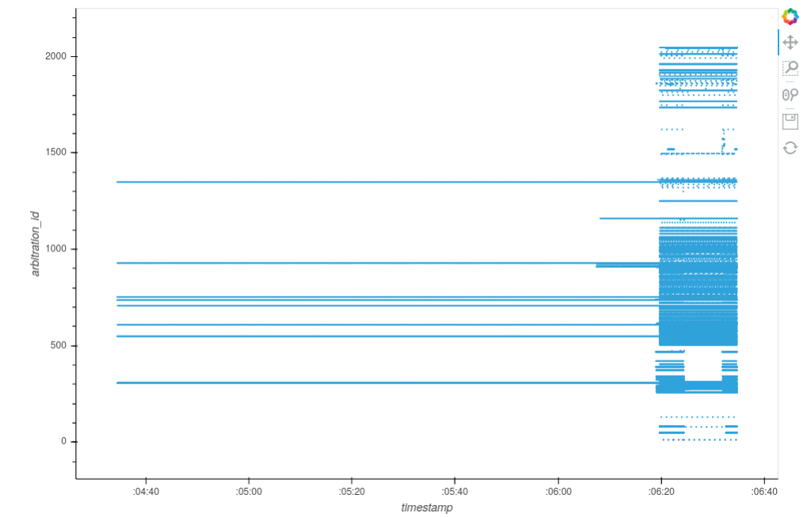
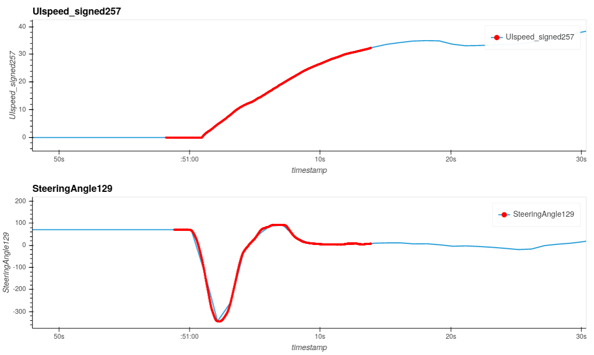
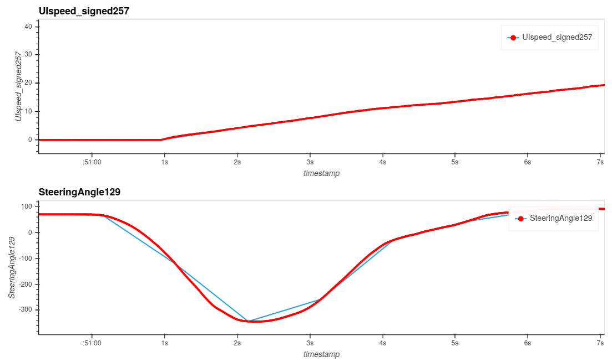
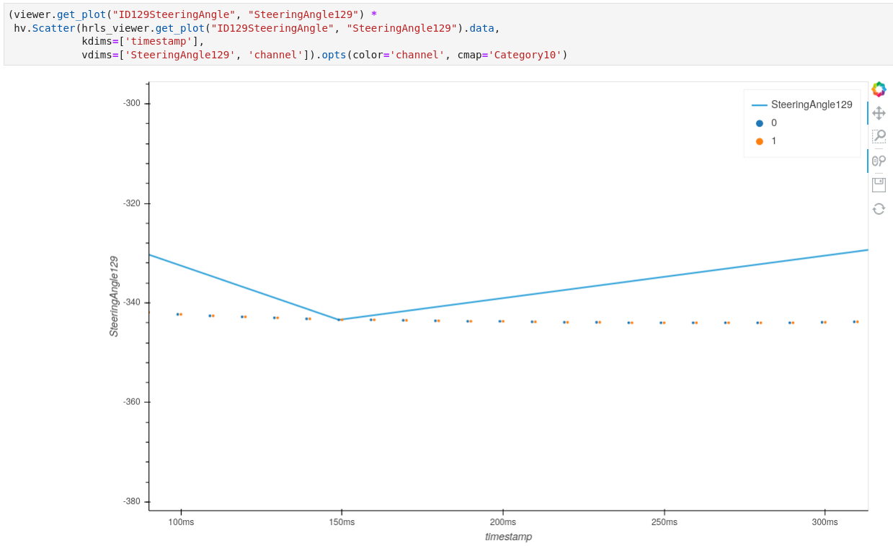

# Model 3 HRL
Besides the **LOG** directory, there's also the **HRL** directory which sparks interest.
Even though the files are relatively small, they have Unix timestamps as their name, and a quick search actually shows someone has already looked into these.
Here's a [blog](https://github.com/lewurm/blog/issues/3) by Lewurm that already gives away quite a bit of information.
They even shared a parser called *toolsa* [here](https://github.com/lewurm/toolsa/).

```bash
➜  HRL ls -l
total 72M
-rwxr-xr-x 1 root root 1.5M Jul 12  2019 5D2817BA.HRL
-rwxr-xr-x 1 root root 1.4M Jul 12  2019 5D289EA2.HRL
-rwxr-xr-x 1 root root 1.5M Jul 13  2019 5D299BE2.HRL
-rwxr-xr-x 1 root root 1.5M Jul 13  2019 5D299D2C.HRL
-rwxr-xr-x 1 root root 1.6M Jul 13  2019 5D29A402.HRL
-rwxr-xr-x 1 root root 1.3M Jul 13  2019 5D29AAAA.HRL
-rwxr-xr-x 1 root root 1.6M Jul 13  2019 5D29AB03.HRL
-rwxr-xr-x 1 root root 1.6M Jul 13  2019 5D29B3B2.HRL
-rwxr-xr-x 1 root root 1.6M Jul 13  2019 5D29BEFB.HRL
-rwxr-xr-x 1 root root 1.6M Jul 13  2019 5D29D32E.HRL
-rwxr-xr-x 1 root root 1.6M Jul 13  2019 5D29D68F.HRL
-rwxr-xr-x 1 root root 1.2M Jul 14  2019 5D2B0CBA.HRL
-rwxr-xr-x 1 root root 1.5M Jul 14  2019 5D2B0D0D.HRL
-rwxr-xr-x 1 root root 1.6M Jul 14  2019 5D2B0E28.HRL
-rwxr-xr-x 1 root root 1.5M Jul 14  2019 5D2B1694.HRL
-rwxr-xr-x 1 root root 1.6M Jul 14  2019 5D2B1F40.HRL
-rwxr-xr-x 1 root root 1.5M Jul 14  2019 5D2B38CA.HRL
-rwxr-xr-x 1 root root 1.5M Jul 14  2019 5D2B391F.HRL
-rwxr-xr-x 1 root root 1.5M Jul 14  2019 5D2B3B1C.HRL
-rwxr-xr-x 1 root root 1.5M Jul 14  2019 5D2B3B52.HRL
-rwxr-xr-x 1 root root 1.4M Jul 14  2019 5D2B6607.HRL
-rwxr-xr-x 1 root root 1.6M Jul 15  2019 5D2C07DF.HRL
-rwxr-xr-x 1 root root 1.3M Jul 15  2019 5D2C8D5F.HRL
-rwxr-xr-x 1 root root 1.6M Jul 15  2019 5D2CAEE3.HRL
-rwxr-xr-x 1 root root 1.5M Jul 15  2019 5D2CB13F.HRL
-rwxr-xr-x 1 root root 1.4M Jul 15  2019 5D2CCBC2.HRL
-rwxr-xr-x 1 root root 1.6M Jul 16  2019 5D2D5DE8.HRL
-rwxr-xr-x 1 root root 1.3M Jul 16  2019 5D2DCDC4.HRL
-rwxr-xr-x 1 root root 1.6M Jul 16  2019 5D2DE75C.HRL
-rwxr-xr-x 1 root root 1.6M Jul 17  2019 5D2ED813.HRL
-rwxr-xr-x 1 root root 1.4M Jul 17  2019 5D2EE94C.HRL
-rwxr-xr-x 1 root root 1.6M Jul 19  2019 5D31541F.HRL
-rwxr-xr-x 1 root root 1.6M Jul 19  2019 5D317869.HRL
-rwxr-xr-x 1 root root 1.6M Jul 19  2019 5D31D12B.HRL
-rwxr-xr-x 1 root root 1.5M Jul 19  2019 5D3203F9.HRL
-rwxr-xr-x 1 root root 1.6M Jul 20  2019 5D32AFD6.HRL
-rwxr-xr-x 1 root root 1.4M Jul 20  2019 5D32FD5C.HRL
-rwxr-xr-x 1 root root 1.5M Jul 20  2019 5D3300F5.HRL
-rwxr-xr-x 1 root root 1.3M Jul 20  2019 5D331FDC.HRL
-rwxr-xr-x 1 root root 1.5M Jul 21  2019 5D341401.HRL
-rwxr-xr-x 1 root root 1.5M Jul 21  2019 5D342FEC.HRL
-rwxr-xr-x 1 root root 1.6M Jul 21  2019 5D3439DE.HRL
-rwxr-xr-x 1 root root 1.5M Jul 21  2019 5D347DEE.HRL
-rwxr-xr-x 1 root root 1.5M Jul 22  2019 5D353FCB.HRL
-rwxr-xr-x 1 root root 1.6M Jul 22  2019 5D35BBD7.HRL
-rwxr-xr-x 1 root root 1.6M Jul 22  2019 5D35F791.HRL
-rwxr-xr-x 1 root root 1.6M Jul 22  2019 5D35FF71.HRL
-rwxr-xr-x 1 root root 1.6M Jul 23  2019 5D36A7C0.HRL
-rwxr-xr-x 1 root root 1.6M Jul 23  2019 5D37289B.HRL
-rwxr-xr-x 1 root root 656K Jul 23  2019 5D373649.HRL
-rwxr-xr-x 1 root root    0 Jan  1  1980 CUR.HRL
```

We will summarize the main findings of Lewurm's blog:
- The HRL is organized in blocks which are checksummed with crc32
- The first block contains header information, including the VIN  
- The blocks contain fixed-size records of 11 bytes. 
- The records contain CAN data, as the data decodes properly when separating out a single arbitration ID (encoded in the lower 11 bits of a value) 

They use the following record structure:
- byte 0: sequence number
- bytes 1-2: CAN id (in the lowest 11 bits)
- bytes 3-10: CAN data bytes

Already, the observation that these are CAN records, and the arbitration ID being in the lower 11 bits of a particular value, seems to closely match the **.LOG** files.
However, the recordsize is 11 bytes now, instead of the 13 byte LOG records.
The checksum-byte per record is likely replaced by the block-based crc32.
The other dropped byte is likely in the counter value, as Lewurm's parser uses only a single byte as *sequence number*.
Here's the first bit of the output of their parser:

```
➜  HRL python ~/source/toolsa/hrl-parser.py ./5D2817BA.HRL
[++] 5D2817BA.HRL is 0x168000 bytes long
[++] Creation date: 2019-07-12 05:16:42 GMT
B01
 CFrame 4000000002ffffffffffff   @··········
 Record 27 / 3ae1 0100020000e0ff72  ·······r
 Record 2c / 1225 0000000000000000  ········
 Record 30 / 3ae1 1021048087250000  ·!···%··
 Record 31 / 3ae1 0100100000e0ff72  ·······r
 Record 38 / 3a61 00005707873f0000  ··W··?··
 Record 3b / 3ae1 8103040000e0ff72  ·······r
 CFrame 4000000046ffffffffffff   @···F······
 Record 00 / 3ae1 8103040000e0ff72  ·······r
 Record 0c / 3d45 fc1ffeeffffe0f5e  ·······^
 Record 13 / 3ae1 0200000000000100  ········
 Record 18 / 3af1 0008000074200000  ····t ··
 Record 28 / 3ae1 033099007fff2a00  ·0····*·
 Record 3c / 3ae1 b4d2ff6113e6b107  ···a····
 Record 3c / 3ba1 0c204695aafa1f6e  · F····n
 Record 3e / 3d45 09796432390010ab  ·yd29···
 CFrame 4000000092ffffffffffff   @··········
 Record 00 / 1225 0000000000000000  ········
 Record 04 / 3ae1 1021048087250000  ·!···%··
 Record 0c / 3a61 00005707873f0000  ··W··?··
 Record 18 / 3ae1 f903240000e0ff72  ··$····r
 Record 23 / 3ae1 f903280000e0ff72  ··(····r
 Record 24 / 3d45 440022d077c927e7  D·"·w·'·
 Record 2b / 3ae1 0200000000000100  ········
 Record 2d / 3932 389a00800080ff0f  8·······
 Record 30 / 3af1 0190ec8034800800  ····4···
 Record 37 / 3932 389a00800080ff0f  8·······
 CFrame 40000000d2ffffffffffff   @··········
 Record 00 / 3ae1 033099007fff2a00  ·0····*·
 Record 01 / 3932 389a00800080ff0f  8·······
 Record 0b / 3932 389a00800080ff0f  8·······
 Record 14 / 3ae1 b4f2206113e6b107  ·· a····
 Record 14 / 3ba1 0c224695aafa2172  ·"F···!r
 Record 15 / 3932 389a00800080ff0f  8·······
 Record 16 / 3d45 09796432390030cb  ·yd29·0·
 Record 1f / 3932 389a00800080ff0f  8·······
 Record 24 / 1225 0004120000000000  ········
 Record 28 / 3ae1 1821048087250000  ·!···%··
 Record 29 / 3932 389a00800080ff0f  8·······
 Record 30 / 3a61 00005707873f0000  ··W··?··
 Record 33 / 3932 389a00800080ff0f  8·······
 Record 3c / 3ae1 f903080000e0ff72  ·······r
 Record 3d / 3932 389a00800080ff0f  8·······
 CFrame 4000000119ffffffffffff   @··········
 Record 00 / 3932 389a00800080ff0f  8·······
 Record 01 / 3d45 f2001d80900c49be  ······I·
 Record 08 / 3ae1 0200000000000100  ········
 Record 0a / 3932 389a00800080ff0f  8·······
 Record 0d / 3af1 0211ef003f80ff7f  ····?···
 Record 14 / 3932 389a00800080ff0f  8·······
 Record 1d / 3ae1 033099002b2c2a00  ·0··+,*·
 Record 1e / 3932 389a00800080ff0f  8·······
 Record 29 / 3932 389a00800080ff0f  8·······
 Record 31 / 3ae1 b452206113e6b107  ·R a····
 Record 31 / 3ba1 0c224615aafa3102  ·"F···1·
 Record 32 / 3932 389a00800080ff0f  8·······
 Record 33 / 3d45 09796432390050eb  ·yd29·P·
 Record 3c / 3932 389a00800080ff0f  8······
 ...
```

We expect Tesla's theme of using rolling timestamps to continue in this log format as well.
If we take a closer look at the *sequence number*, we see toolsa considers the upper 2 bits as a flag.
If one of these two bits is set, it's considered a *Control Frame* or CFrame.
Again, this pattern is familiar, we now expect these frames  to update the rolling timestamp.
Let's zoom in on these CFrames:

```
➜  HRL python ~/source/toolsa/hrl-parser.py ./5D2817BA.HRL | grep -B 1 -A 1 CFrame | head -n 50
B01
 CFrame 4000000002ffffffffffff   @··········
 Record 27 / 3ae1 0100020000e0ff72  ·······r
--
 Record 3b / 3ae1 8103040000e0ff72  ·······r
 CFrame 4000000046ffffffffffff   @···F······
 Record 00 / 3ae1 8103040000e0ff72  ·······r
--
 Record 3e / 3d45 09796432390010ab  ·yd29···
 CFrame 4000000092ffffffffffff   @··········
 Record 00 / 1225 0000000000000000  ········
--
 Record 37 / 3932 389a00800080ff0f  8·······
 CFrame 40000000d2ffffffffffff   @··········
 Record 00 / 3ae1 033099007fff2a00  ·0····*·
--
 Record 3d / 3932 389a00800080ff0f  8·······
 CFrame 4000000119ffffffffffff   @··········
 Record 00 / 3932 389a00800080ff0f  8·······
--
 Record 3c / 3932 389a00800080ff0f  8·······
 CFrame 400000015affffffffffff   @···Z······
 Record 00 / 1225 0004120000000000  ········
--
 Record 37 / 3932 389a00800080ff0f  8·······
 CFrame 400000019affffffffffff   @··········
 Record 00 / 3ae1 033099002b2c2a00  ·0··+,*·
--
 Record 3d / 3932 389a00800080ff0f  8·······
 CFrame 40000001e2ffffffffffff   @··········
 Record 00 / 3932 389a00800080ff0f  8·······
--
 Record 3b / 3932 389a00800080ff0f  8·······
 CFrame 4000000222ffffffffffff   @···"······
 Record 00 / 1225 0004120000000000  ········
--
 Record 37 / 3932 389a00800080ff0f  8·······
 CFrame 4000000262ffffffffffff   @···b······
 Record 00 / 3ae1 03de99002b2c2a00  ····+,*·
--
 Record 3d / 3932 389a00800080ff0f  8·······
 CFrame 40000002aaffffffffffff   @··········
 Record 00 / 3932 389a00800080ff0f  8·······
--
 Record 3b / 3932 389a00800080ff0f  8·······
 CFrame 40000002eaffffffffffff   @··········
 Record 00 / 1225 0004120000000000  ········
--
 Record 37 / 3932 389a00800080ff0f  8·······
 CFrame 400000032affffffffffff   @···*······
```

If we discard the 0xff's, each CFrame contains a value in the first 32-bit integer of its payload.
This value increases by roughly 0x40 for each consecutive CFrame. 
The rolling timestamp value is not a Unix timestamp however. 
In the example above, the first value is just **2**. 
From now on we'll call this first byte the *counter*.
Another observation is that this counter  value increments with steps usually larger than 1 at the beginning of the HRL, whereas multiple records with the same counter value occur later on in the HRL.
We'll illustrate this by viewing the tail of the same grep command as above:

```
➜  HRL python ~/source/toolsa/hrl-parser.py ./5D2817BA.HRL | grep -B 1 -A 1 CFrame | tail -n 50
 CFrame 400000c5fa8d001fec2bfc   @········+·
 Record 00 / 7901 040066003540c5a6  ··f·5@··
--
B87
 CFrame 400000c5fbffffffffffff   @··········
 Record 00 / 3bc2 2955000000000000  )U······
--
 Record 3f / 9051 316a0a000120ff3f  1j··· ·?
 CFrame 400000c63b2e1429000000   @···;.·)···
 Record 00 / 5051 316a0a000120ff3f  1j··· ·?
--
 Record 3f / 3b83 77007600c0008205  w·v·····
 CFrame 400000c67b0000000054da   @···{····T·
 Record 00 / bdef 140500000a1a2cae  ······,·
--
 Record 3f / 4988 0532000074ac0f04  ·2··t···
 CFrame 400000c6bb048087250000   @·······%··
 Record 00 / bf20 0000000000000000  ········
--
B88
 CFrame 400000c6c0ffffffffffff   @··········
 Record 01 / 7975 fee13f088800a1c5  ··?·····
--
 Record 3f / 3ac1 b0041b0a8f1f0000  ········
 CFrame 400000c70007b81fe9056e   @·········n
 Record 00 / 7955 59be32a5009d00e1  Y·2·····
--
 Record 3f / 7b70 3203080f1ffd24ff  2·····$·
 CFrame 400000c740000000000000   @···@······
 Record 00 / 9031 f754020000510000  ·T···Q··
--
 Record 3f / 7975 fd2140f887fed021  ·!@····!
 CFrame 400000c78007e31fe70294   @··········
 Record 00 / 7901 f9ff2d800140351d  ··-··@5·
--
B89
 CFrame 400000c787ffffffffffff   @··········
 Record 00 / 7ab9 cd00f00eb10b7abc  ······z·
--
 Record 3f / 9219 0a0126000000a42a  ··&····*
 CFrame 400000c7c700000020ff3f   @······· ·?
 Record 00 / 738d 4404000000404600  D····@F·
--
 Record 3f / 3a21 605555155451d5bc  `UU·TQ··
 CFrame 400000c807000000404600   @·······@F·
 Record 00 / 3ad2 375e589d17089f24  7^X····$
--
 Record 3f / 87fe 0000000000e0ff72  ·······r
 CFrame 400000c847401146110000   @···G@·F···
 Record 00 / 23a3 12d0000008000000  ········
```

You'll notice more lines contain **Bxx** now, these are the block boundary markers printed by toolsa.
In other words, there are fewer CFrames per block, which is the same observation of increased record frequency as phrased above.
To actually tie these rolling counter values to Unix timestamps, we take a closer look at the HRL header block:

```
➜  HRL xxd  ./5D2817BA.HRL | head -n5  
00000000: 0166 625e 9323 74c7 aef1 3e56 60fb bb02  .fb^.#t...>V`...
00000010: 033d da7b 7435 594a 3345 3745 4258 4b46  .=.{t5YJ3E7EBXKF
00000020: .... .... .... 0003 015d 2817 87ff ffff  .........](.....
00000030: ffff ffff ffff ffff ffff ffff ffff ffff  ................
00000040: ffff ffff ffff ffff ffff ffff ffff ffff  ................
```

As this also contains the VIN, we've anonymized some bytes.
Note that the 32 bit value at offset 0x29 is a Unix timestamp which is close the the Unix timestamp in the filename.
The timestamp in the filename is actually later than the one in the header block.
If we compare the difference in these two timestamps with the last CFrame payload value, we get an idea of the timestamping mechanism:

```python
In[3]: 0x5d2817ba-0x5d281787
Out[3]: 51
In[4]: 0xc847
Out[4]: 51271
```

These values are similar when scaled by factor of 1000, which is likely for millisecond accuracy just as in the .LOG files.
Combining all these observations: 
- The timestamp in the header block is likely the start-timestamp
- The rolling counter value in the CFrames is measured in milliseconds relative to this starting timestamp
- The counter value of each record is measured relative to the value in the most recent CFrame's rolling counter
- The timestamp in the filename is likely when the file was written to the SD-card

The remaining payload of the HRL records is structured the same as the LOG records; so the bus_id, dlc and arbitration_id are encoded in 16 bits, followed by the up to 8 bytes long CAN data.
We implemented a parser using Kaitai struct for the HRL, which is slower than a vectorized version, but hopefully easier to read.
The parser can be found [here](/teslalogs/model_3/HRL.py) with the accompanying .ksy file [here](/teslalogs/model_3/Model3_HRL.ksy).

## Visualization
We mentioned earlier that the HRL record frequency changes from the beginning to the end of the file.
The main reason for this seems to be a pre-trigger buffer which is used.
This is clearly visible if we plot the CAN arbitration id over time:



A small subset of messages is stored for a longer period of time continually, likely kept in a ringbuffer in memory untill the actual HRL is triggered.
After triggering, it seems like all CAN messages of 3 buses are stored.
This transision is clearly visible in each HRL file.

Since the HRL's are basically CAN logs, we can reuse our visualization tools for the .LOG files.
By picking an HRL with some signal activity, and looking up the corresponding timespan in the .LOG file, we can visualize both of them in time:



The blue line plot is the signal as viewed from the .LOG files, whereas the overlaid red scatter plot contains individual data points from the HRL.
If we zoom in, we can see the difference in sampling frequency between the .LOG and .HRL:



Zooming in even further, we can even see the signals occuring on multiple buses.
The .LOG file has both signals stored at 1Hz, whereas the HRL stores the vehicle speed at 50Hz and the steering wheel angle at 100Hz.
With a slight modification, we can encode the bus_id as color in the HRL scatter plot (which we will only do for the steering wheel angle for simplicity):



The bus_id 0 corresponds to the vehicle bus and the bus_id 1 corresponds to the party bus.
In the plot above, we can see that the steering wheel angle signal is usually received first on the vehicle bus and then on the party bus with a slight delay, at least in the logging plot above, of about 1 millisecond.
This delay is also observed to be 0 or sometimes 2 milliseconds.
Perhaps this is because the signal is routed through the gateway, or because the messages are sent redundantly on both buses.

## Other observations
The acronym HRL likely stands for: "High Resolution Log", a name which can be found in the decompiled odin software on the MCU.
Conditions that trigger the recording of these files is unknown, however the deployment of airbags or detection of a vehicle crash seems to be one.
We've observed the HRL files to change slightly in structure over software updates.
In early Model 3 versions, the format was as described above, with blocksizes of 0x4000. 
For later versions, this blocksize was increased to 0x8000, and also more blocks seemed to be recorded.
More recently the HRL files seem to be recorded on the gtw SD card and then copied over to the MCU storage, after which the file is deleted from the SD card.
The HRL is subsequently uploaded to Tesla's servers and also deleted from the MCU.
It is however still possible to carve for deleted HRL files due to their structure on both the SD card and the MCU eMMC (if not encrypted) if one makes a physical copy.