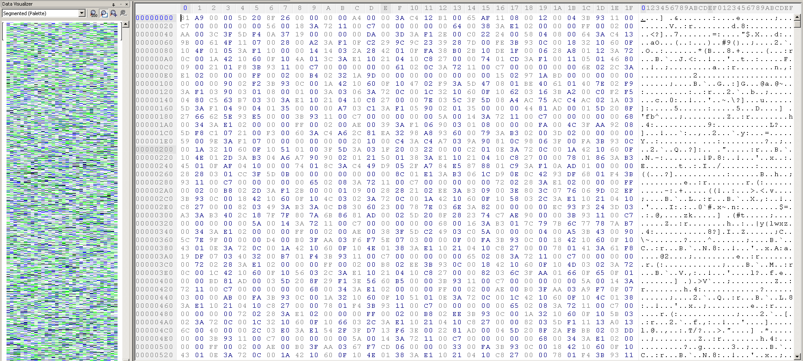
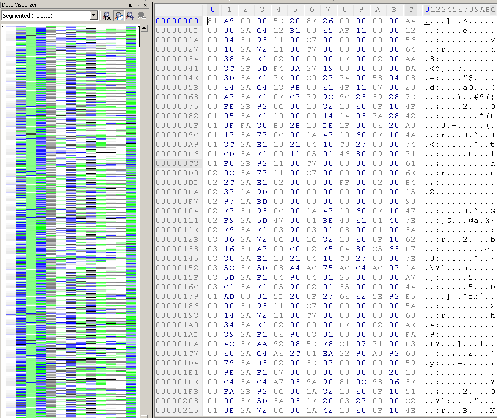
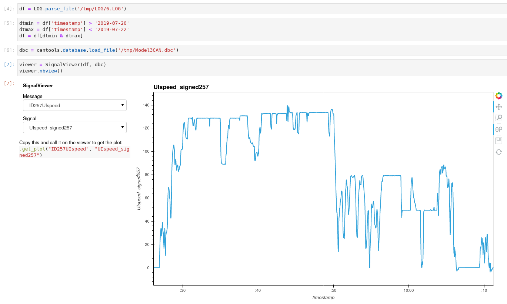
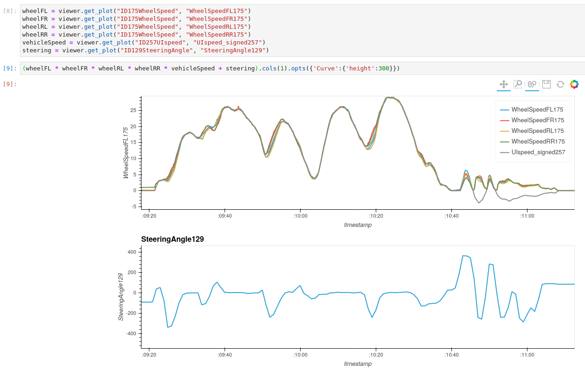

# Model 3 logs
The Model 3 has a completely different architecture than the Model S and X.
Both the MCU and the autopilot computer are housed together in what's called the 'car computer', a single housing which facilitates liquid cooling for both.
This is a large contrast with the separate MCU and AP computers in the Model S and X.
It also has a newer gateway microcontroller, an NXP SPC5748GSMMJ6 compared to the MPC5668G in the Model S.
The gateway still has an SD-card attached though, this time a micro-SD, which is 8GB compared to the older regular SD size of 4GB.
Inside the SD we again find a single FAT partition with a /LOG directory:

```
➜  SD ls -l
total 928K          
-rwxr-xr-x 1 root root  23K Apr  9  2019 0023
-rwxr-xr-x 1 root root  23K Apr  9  2019 0024
-rwxr-xr-x 1 root root  93K Jun 26  2019 002A
-rwxr-xr-x 1 root root  55K Jun 26  2019 002E
-rwxr-xr-x 1 root root 209K Jun 26  2019 BOOTED.IMG
-rwxr-xr-x 1 root root  738 Jun 26  2019 CBREAKER.MAP
-rwxr-xr-x 1 root root   32 Feb 22  2019 FW3TEST
-rwxr-xr-x 1 root root  86K Feb 22  2019 GW.HGZ
drwxr-xr-x 2 root root  32K Feb 22  2019 HRL
drwxr-xr-x 2 root root  32K Feb 22  2019 LOG 
-rwxr-xr-x 1 root root  74K Jun 26  2019 MAP.TSV
-rwxr-xr-x 1 root root    0 Jan 25  2019 MFGTEST
-rwxr-xr-x 1 root root 5.2K Jun 26  2019 MODINFO.LOG
-rwxr-xr-x 1 root root    0 Jan  1  1980 PMIC.TXT  
-rwxr-xr-x 1 root root  76K Jun 26  2019 UDSDEBUG.LOG
drwxr-xr-x 2 root root  32K Feb 22  2019 UPDT 
➜  SD ls -l LOG
total 2.0G
-rwxr-xr-x 1 root root 301M Apr  6  2019 0.LOG
-rwxr-xr-x 1 root root 301M Apr 18  2019 1.LOG
-rwxr-xr-x 1 root root 301M May 14  2019 2.LOG
-rwxr-xr-x 1 root root 301M May 28  2019 3.LOG
-rwxr-xr-x 1 root root 301M Jun 18  2019 4.LOG
-rwxr-xr-x 1 root root 301M Jul  6  2019 5.LOG
-rwxr-xr-x 1 root root 233M Jul 23  2019 6.LOG
-rwxr-xr-x 1 root root    2 Jul  6  2019 LOGINFO.TXT
➜  SD cat LOG/LOGINFO.TXT
6
```

The log seems similar in directory structure as the Model S and X logs; the directory name is the same: LOG, and the files are numbered where the latest file has not reached a certain maximum size.
The file **LOGINFO.txt** points to the latest logfile.
In other vehicles we've seen that there may be 10 log files (0 through 9) which form a ring log:
When **9.LOG** is full, **0.LOG** is cleared and reused for new incoming data, very similar to the Model S and X logs.

Looking at the log, we see it does not match the TLV-structure of the Model S and X logs which have 0xaa as delimiter between each record.



If we change the number of columns per row to 13 however, the visual pattern reveals that these are likely fixed-length records (leveraging Hex Workshop's data visualizer):



The first 2 bytes clearly seem to be a counter, probably for timekeeping as it does not have fixed increments.
After the counter there seems to be one byte with similar values, followed by at least 8 more bytes. 
At this stage we already expect this to be CAN messages as these are, in the default use case, limited to 8 byte payloads.
The last byte appears more random, this might be a checksum?

A simple check confirms this is the same simple checksum as used in the Model S and X logs:

```python
In [1]: data = open('LOG/6.LOG','rb').read(0xd*10)

In [2]: for i in range(0, len(data), 0xd):
    ..:     print(i, sum(data[i:i+0xd]) % 0x100)
0 0
13 0
26 0
39 0
52 0
65 0
78 0
91 0
104 0
117 0
```

The sum of all the bytes in a record including the checksum have to add up such that the modulo with 0x100 equals zero.

Assuming that these are in fact CAN messages, we expect more information to be encoded. 
A CAN message frame has an arbitration identifier, a data length field (dlc) and a payload of said length.
Given that the log entries are fixed size, likely for efficient indexing, the dlc must be encoded as not all can messages will be 8 bytes long.

Right now we assume we have all but 2 bytes covered:

Bytes:
```
0-1: counter
2-3: unknown 
4-11: payload data
12: checksum
```

By elimination, we now expect that the unknown 2 bytes contain the CAN arbitration ID and dlc, which are 11 bit and 4 bit values respectively, and therefore should fit in 16 bits and maybe leave room for a bus id.
To test this hypothesis, we need to get a feeling for which identifiers could be present in the logs.
Fortunately, enthusiasts have spent time reverse engineering the CAN message payloads for the Tesla Model 3, and share the .dbc on [github](https://github.com/joshwardell/model3dbc/blob/master/Model3CAN.dbc).
But just as with the Model S dbc's, these message definitions change over time due to Tesla's frequent over-the-air updates (something that is highly uncommon for conventional OEM's).
Therefore, we'll use the database from github cautiously, and just to get a feeling for the arbitration id's.

An initial Python snippet seems promising, when we assume the arbitration ID to be in the lower 11 bits:
```python
In [50]: import struct
    ...: import cantools
    ...: from collections import Counter
    ...: 
    ...: data = open('LOG/6.LOG','rb').read(0xd * 100000)
    ...: dbc = cantools.db.load_file('model3dbc/Model3CAN.dbc')
    ...: dbc_messages = [m.frame_id for m in dbc.messages]
    ...: log = Counter()
    ...: 
    ...: for i in range(0, len(data), 0xd):
    ...:     short = struct.unpack('>2xH9x', data[i:i+0xd])[0]
    ...:     arb_id = short & 0x7ff
    ...:     log[arb_id] += 1
    ...: 
    ...: len(dbc_messages) / len(log)  # overlap between dbc and log arbitration id's
Out[50]: 0.5672268907563025

In [51]: list(sorted(log.items(), key=lambda x:x[1], reverse=True))  # (arb_id, count)
Out[51]:    
[(737, 11902),
 (915, 11308),
 (626, 11308),
 (880, 6690),
 (753, 4496),
 (373, 3092),
 (1962, 3086),
 (1160, 2718),
 (708, 2323),
 (297, 1929),
 (280, 1897),
 (925, 1502),
 (1497, 1257),
 (922, 1222), 
 (1885, 1180),
 (273, 954),  
 (705, 882), 
 (697, 735), 
 (257, 677), 
 (390, 675), 
 (264, 675),  
 (1815, 675), 
 (836, 672), 
 (777, 661), 
 (910, 645), 
 (599, 625),  
 (616, 619),  
 (294, 609),  
 (341, 588),
 (642, 567),                                                       
 (513, 545),
 (614, 514),  
 (611, 501),  
 (909, 461),  
 (551, 450), 
 (691, 436), 
 (1001, 415),
 (646, 390),  
 (389, 388),  
 (921, 380), 
 (882, 364), 
 (1861, 360),
 (889, 346), 
 (421, 334),  
 (930, 331),  
 (615, 329),  
 (929, 320),  
 (605, 307), 
 (905, 303), 
 (637, 286), 
 (669, 283), 
 (701, 283),  
 (835, 283),  
 (609, 283), 
......
```

The reverse engineered database of course does not contain an entry for each arbitration ID, but there's still a decent amount of overlap.
The arbitration ID's also seem valid as the distribution is far from random and some appear more frequent than others.

Now for the remaining 5 bits:
```python
In [55]: import struct                                                                                                                                                                             
    ...: import cantools  
    ...: from collections import defaultdict
    ...:                  
    ...: log = defaultdict(set)
    ...: data = open('LOG/6.LOG','rb').read(0xd * 100000)
    ...: dbc = cantools.db.load_file('model3dbc/Model3CAN.dbc')
    ...: dbc_messages = [m.frame_id for m in dbc.messages]
    ...:                  
    ...: for i in range(0, len(data), 0xd):
    ...:     short = struct.unpack('>2xH9x', data[i:i+0xd])[0]
    ...:     arb_id = short & 0x7ff
    ...:     test = (short >> 11) & 0x1f
    ...:     if arb_id in dbc_messages:
    ...:         log[arb_id].add(test)
    ...:                  
    ...: for arb_id, test in sorted(log.items(), key=lambda x:x[0]):
    ...:     msg = dbc.get_message_by_frame_id(arb_id)
    ...:     print(arb_id, [f'{x:>05b}' for x in test], msg.senders[0], msg.length)
    ...:                  
12 ['11111'] VehicleBus 8 
130 ['11111'] VehicleBus 8
257 ['10111'] ChassisBus 8
258 ['00111'] VehicleBus 8
259 ['00111'] VehicleBus 8         
264 ['01111'] VehicleBus 8
280 ['01111'] VehicleBus 8
291 ['00110'] VehicleBus 8
294 ['00010'] VehicleBus 3
297 ['00111'] VehicleBus 8
306 ['00111'] VehicleBus 8
325 ['10111'] ChassisBus 8
340 ['00111'] VehicleBus 8
341 ['01111'] ChassisBus 8
373 ['10111'] ChassisBus 8
390 ['01111'] VehicleBus 8
421 ['00010'] VehicleBus 3
468 ['00111'] VehicleBus 8 
513 ['00111'] VehicleBus 8 
524 ['00101'] VehicleBus 7 
530 ['00111'] VehicleBus 8 
545 ['00111'] VehicleBus 8 
548 ['00111'] VehicleBus 8 
552 ['00111'] VehicleBus 8 
553 ['00010', '10111'] VehicleBus 3
568 ['11111'] ChassisBus 8 
569 ['10111'] ChassisBus 8 
577 ['00110'] VehicleBus 7 
579 ['00111'] VehicleBus 8
583 ['10111', '00111'] VehicleBus 8
585 ['00010'] VehicleBus 4
594 ['00111'] VehicleBus 8
599 ['01111'] VehicleBus 8
603 ['10000'] ChassisBus 1
609 ['00111'] VehicleBus 8
611 ['01111', '00111'] VehicleBus 8
612 ['00101'] VehicleBus 8
614 ['00111'] VehicleBus 8
615 ['00110'] VehicleBus 8
616 ['00100'] VehicleBus 5
642 ['00111'] VehicleBus 8
644 ['11100'] VehicleBus 5
647 ['00111'] VehicleBus 8
648 ['00111'] VehicleBus 8
658 ['00111'] VehicleBus 8
659 ['11111'] VehicleBus 8
691 ['00111'] VehicleBus 8
694 ['00001'] VehicleBus 2
697 ['10111'] ChassisBus 8
705 ['00111'] VehicleBus 8
708 ['00111'] VehicleBus 8
722 ['00111'] VehicleBus 8
723 ['11111'] ChassisBus 8
737 ['00111'] VehicleBus 8
741 ['00110'] VehicleBus 8
753 ['00111'] VehicleBus 8
777 ['10111'] VehicleBus 8
786 ['00110'] VehicleBus 8
789 ['00111'] VehicleBus 8
799 ['10111'] ChassisBus 8
818 ['00101'] VehicleBus 6
826 ['11111'] VehicleBus 8
850 ['00111'] VehicleBus 8
886 ['00111'] VehicleBus 8
897 ['00111'] VehicleBus 8
899 ['00111'] VehicleBus 8
905 ['10111'] ChassisBus 8
915 ['00111'] VehicleBus 8
917 ['00111'] VehicleBus 8
918 ['00111'] VehicleBus 8
921 ['10111'] ChassisBus 8
925 ['10100'] ChassisBus 5
946 ['00111'] VehicleBus 8
950 ['00011'] VehicleBus 4
962 ['00111'] VehicleBus 8
963 ['00110'] VehicleBus 7
978 ['00111'] VehicleBus 8
985 ['11110'] ChassisBus 8
995 ['00001'] VehicleBus 2
1001 ['00111'] VehicleBus 8
1010 ['00111'] VehicleBus 8
1011 ['11010'] ChassisBus 3
1022 ['00100'] VehicleBus 5
1366 ['00110'] VehicleBus 5
1367 ['00010'] VehicleBus 4
1493 ['00110'] VehicleBus 5
1879 ['00111'] VehicleBus 8
1885 ['00111'] VehicleBus 8
1962 ['00111'] VehicleBus 8
2005 ['00111'] VehicleBus 8
```

First, note that there's usually one unique 5-bit value per arbitration id, this further supports the idea that the arbitration id's are correct, we'd expect more randomness otherwise.
The lower 3 bits seem to equal the dlc value minus 1, which is an interesting way to save 1 bit of space. 
This means it is impossible to log CAN messages with zero length, which are typically infrequent anyway.
Having this extra bit does allow for 2 bits, or 4 distinct values, worth of bus identifiers instead of a single bit or 2 distinct values.
The upper 2 bits seem to correlate with - but are not always equal to - the bus that's noted in the dbc of having the message with that arbitration_id.
Some arbitration ID's have several unique 5 bit values, it seems that these occur on multiple buses with a different meaning on each.

Note that the dbc  is likely incomplete. 
The actual CAN buses on a Model 3 are: Chassis, Vehicle, Party and Ethernet.
However, since only the Chassis and Vehicle bus are easily accessible physically to attach a CAN adapter to, these are the ones that are reverse engineered and put in the dbc.

As it is starting to look more and more like the log entries are in fact CAN messages; we expect there is also a timestamping mechanism of some sorts.
The Model S and X logs used to have a rolling timestamp to limit the space needed to record the timestamp of each log entry. 
Looking at the 2-byte counter in each log entry, something similar is probably used in this log format too.
Just as with the S and X logs, the rolling timestamp should occur near the point where the counter overflows or resets.
We can actually observe something happening in the counter value just before it resets.
The most significant bit is set, and the rest of the entry's structure also seems to change, and also contain a unix timestamp.

As a sanity check, lets observe the unique values of the first byte over a big range of entries:

```python
In [65]: import struct
    ...: 
    ...: data = open('LOG/6.LOG','rb').read(0xd * 1000000)
    ...: vals = set()
    ...: for i in range(0, len(data), 0xd):
    ...:     first = struct.unpack('>B12x', data[i:i+0xd])[0]
    ...:     vals.add(hex(first))
    ...: print(list(sorted(vals)))
['0x0', '0x1', '0x2', '0x3', '0x40', '0x80', '0x81', '0x82', '0x83', '0xc0', '0xc1', '0xc2', '0xc3']
```

It seems that also the next bit can be used as a flag: so 0x80 and 0x40 (or both: 0xc0). 
All remaining bits for the counter can then run up to 0x3ff or 1023.
The value of 1000 will likely be in milliseconds, which seems to be confirmed when viewing subsequent rolling unix timestamps incrementing by 1 second.

```python
In [7]: data = open('LOG/6.LOG', 'rb').read(0xd*1000)
In [8]: for i in range(0, len(data), 0xd): 
   ...:     entry = data[i:i+0xd]  
   ...:     if entry[0] & 0x80:  
   ...:         print(entry.hex())  
```
```
81a9 0000 5d208f26 00000000 a4
81ad 0001 5d208f27 66625e93 e5
81ad 0002 5d208f28 2374c7ae 90
81ad 0003 5d208f29 f13e5660 b5
81ad 0004 5d208f2a fbbb0203 dd
81ad 0005 5d208f2b 3dda7b74 90
81ad 0006 5d208f2c 35594a33 89
81ad 0007 5d208f2d 45374542 8f
c397 2d5f 1ef1d03b 65640000 37
81ad 0008 5d208f2e 584b4632 75
81ad 0009 5d208f2f ........ ba
81ad 000a 5d208f30 ..000000 ..
81ad 000b 5d208f31 00000001 89
81ad 0000 5d208f32 00000000 94
c35f 1116 009e0100 00000000 18
81ad 0001 5d208f33 66625e93 d9
81ad 0002 5d208f34 2374c7ae 84
81ad 0003 5d208f35 f13e5660 a9
81ae 0004 5d208f36 fbbb0203 d0
81ae 0005 5d208f37 3dda7b74 83
c396 2d5f 1f11d13b 64630000 18
81c1 0006 5d208f38 35594a33 69
81c1 0007 5d208f39 45374542 6f
81c1 0008 5d208f3a 584b4632 55
81c1 0009 5d208f3b ........ 9a
81c1 000a 5d208f3c ..000000 ..
81c1 000b 5d208f3d 00000001 69
81c1 0000 5d208f3e 00000000 74
81c1 0001 5d208f3f 66625e93 b9
81c1 0002 5d208f40 2374c7ae 64
81c1 0003 5d208f41 f13e5660 89
c34b 1116 00a10100 00000000 29
c383 2d5f 1f21d23c 65640000 17
81c1 0004 5d208f42 fbbb0203 b1
81c1 0005 5d208f43 3dda7b74 64
81c1 0006 5d208f44 35594a33 5d
81c1 0007 5d208f45 45374542 63
81c1 0008 5d208f46 584b4632 49
81c1 0009 5d208f47 ........ 8e
81c1 000a 5d208f48 ..000000 ..
81c1 000b 5d208f49 00000001 5d
81c1 0000 5d208f4a 00000000 68
81c1 0001 5d208f4b 66625e93 ad
c383 2d5f 1f31d33c 65640000 06
81c1 0002 5d208f4c 2374c7ae 58
81c1 0003 5d208f4d f13e5660 7d
81c1 0004 5d208f4e fbbb0203 a5
81c1 0005 5d208f4f 3dda7b74 58
81c1 0006 5d208f50 35594a33 51
c34b 1116 00a40100 00000000 26
81c1 0007 5d208f51 45374542 57
81c1 0008 5d208f52 584b4632 3d
81c1 0009 5d208f53 ........ 82
81c1 000a 5d208f54 ..000000 ..
81c1 000b 5d208f55 00000001 51
```

For convenience, we've split the lines in columns: the counter and flags, two unknown bytes, a timestamp, 4 more unknown bytes and the checksum byte.
The rows containing both flag bits (0xc0), seem different in structure than just the 0x80 flag. 
We'll not consider those for now.
The column next to the counter seems to increment by 1 for each timestamping message, up to a value of 0x0b before it overflows back to 0x00.
As mentioned, the next column contains a unix timestamp which increments by 1, which supports our idea bout the counter being in millisecond resolution.
The last 4 byte value seems to be coupled to the cycling value from 0x00-0x0b, having fixed values:
- The value 0x00: 0x00000000
- The values 0x01-0x05 contains the git revision hash of the gtw firmware.
  
  The first 7 nibbles of this hash can be used on [Teslafi's firmware tracker](https://www.teslafi.com/firmware.php) to see this is version *2019.20.4.2 66625e9*.
- The values 0x06-0x0a contain the VIN, which is why we anonymized part of it.
- The value 0x0b: 0x00000001


## Parser
The log file's fixed size entries allow for efficient processing.
For this reason we decided to write a simple parser using vectorized numpy code.
By doing so, we sacrifice some readability for processing speed.
We also don't have the declarative structure using Kaitai struct.

Because of the increased speed, we also do not require an intermediate storage file format for the processed logs.
This was actually necessary due to the slow parsing of TLV's for the Model S and X logs, but allow for quick loading for visualization and analysis.
We can import the parser directly from a Jupyter notebook and load the log into a dataframe for easy manipulation and visualization afterwards.

Do keep in mind though, that this way you easily load a large volume of data and the visualization may not be able to be as quick as desired.
Of course, you can always easily take a slice in time out of the dataframe and visualize just that for a snappy experience.



The Model 3 actually logs individual wheel speeds too, in contrast to the Model S and X.
We can sanity check this by viewing them in relation to the steering wheel angle.
When steering, the outer wheel should turn faster than the inner wheels:



There's plenty to see on this figure:
- Holoviews allows for painless composing of interactive linked lots, by overloading the addition and multiplication functions.
- The vehicle speed and steering wheel angle are logged at 1Hz, whereas the wheel speeds are at 5Hz.
- The vehicle speed is a signed value, while the wheel speeds are unsigned.  
- The signals behave as expected, showing varying wheel speeds when cornering.

You should be able to analyze whatever you want form these logs using these tools, or by augmenting them with your own.
