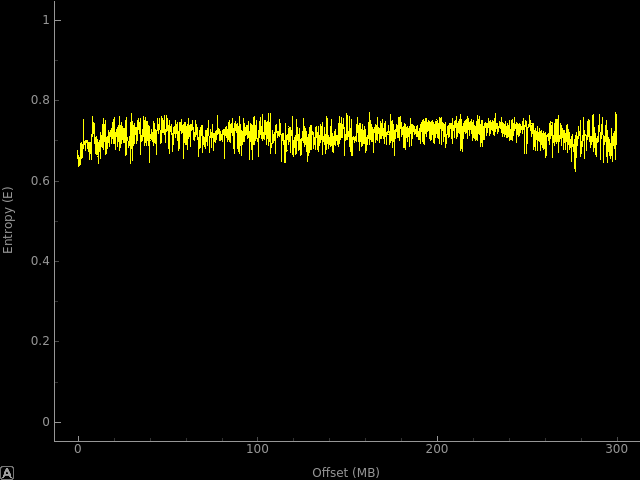
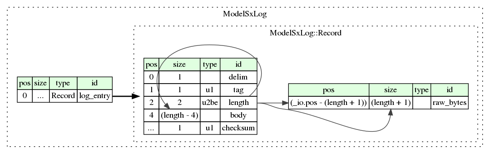
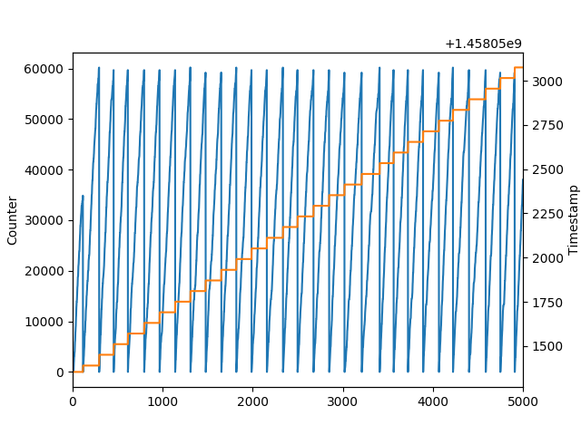
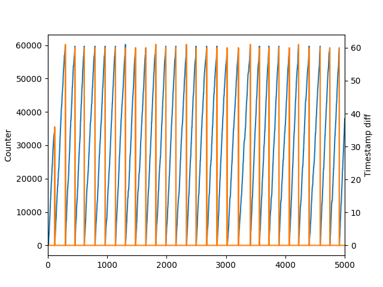
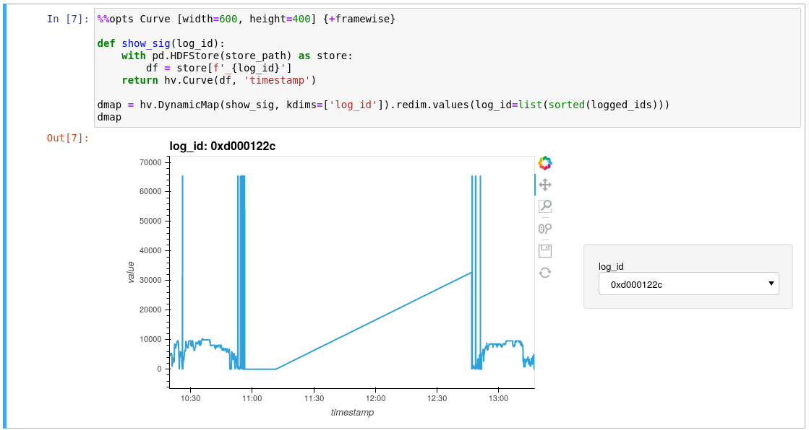
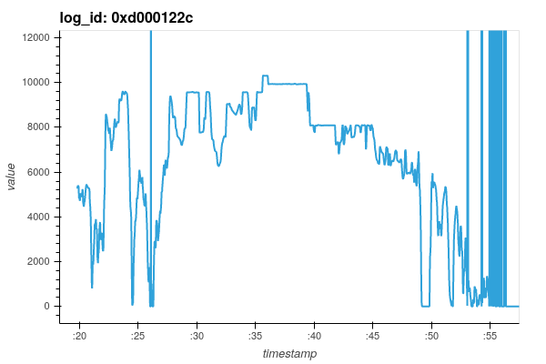

# Model S/X logs
The Model S and X are very similar in their architecture, both use the same MCU.
An MCU pcb contains 2 SD cards, one regular and one micro-SD (map-data).
Tesla's vehicle logs are stored on the regular sized SD-card, which is a 4GB card with a single FAT32 partition:
```bash
➜  SD ls -l
total 10176
drwxr-xr-x 2 root root   32768 Jan  1  1980 chg_wvfm
drwxr-xr-x 2 root root   32768 Jan  1  1980 config
drwxr-xr-x 7 root root   32768 Jan  1  1980 das
drwxr-xr-x 2 root root   32768 Jan  1  1980 dtc
drwxr-xr-x 3 root root   32768 Jan  1  1980 edr
-rwxr-xr-x 1 root root     740 Jan  1  1980 except.dat
-rwxr-xr-x 1 root root   14835 Jan  1  1980 hwidacq.log
-rwxr-xr-x 1 root root     376 Jan  1  1980 hwids.acq
-rwxr-xr-x 1 root root     376 Jan  1  1980 hwids.txt
drwxr-xr-x 2 root root   32768 Jan  1  1980 log
-rwxr-xr-x 1 root root     100 Jan  1  1980 manexcep.txt
-rwxr-xr-x 1 root root  192287 Jan  1  1980 map.tsv
-rwxr-xr-x 1 root root       0 Jan  1  1980 modhwid.log
-rwxr-xr-x 1 root root    1785 Jan  1  1980 modinfo.log
-rwxr-xr-x 1 root root     938 Jan  1  1980 orig_int.dat
-rwxr-xr-x 1 root root 9571470 Jan  1  1980 release.tgz
-rwxr-xr-x 1 root root   99233 Jan  1  1980 udsdebug.log
-rwxr-xr-x 1 root root    4793 Jan  1  1980 update.log
-rwxr-xr-x 1 root root     129 Jan  1  1980 versions.acq
➜  SD cd log
➜  log ls -l
total 896096
-rwxr-xr-x 1 root root 300000029 Jan  1  1980 0.log
-rwxr-xr-x 1 root root 300000012 Jan  1  1980 1.log
-rwxr-xr-x 1 root root 300000019 Jan  1  1980 2.log
-rwxr-xr-x 1 root root  17416574 Jan  1  1980 3.log
-rwxr-xr-x 1 root root     40050 Jan  1  1980 log.cfg
-rwxr-xr-x 1 root root        52 Jan  1  1980 offsets.txt
➜  log cat offsets.txt
offset 17416710 3
maxLogLen 300000000
numLogFiles 5
```
The **log** directory is the directory of interest here.
The **offsets.txt** file contains some configuration information; 
* The first line seems to point to the filename: **3.log** and offset in that file to write to next.
* **maxLogLen** seems self-explanatory, when viewing the file sizes of the **[0-2].log** files. 
  When a log is written past the maximum size, a new file is created.
* **numLogFiles** also is self-explanatory. Vehicles with high-mileage or use time will have completely filled the files **[0-4].log**,
  at which point **0.log** gets cleared and used for new incoming data.
  
The **log.cfg** file is too long to show here, you can view it [here](files/log.cfg).
Some interesting snippets, however are:
```
logFilterVersion 1
fileIsReload 1

condition aebEventActive,3489804314,2
condition chargeModeModelS,3489807971,3
condition driveModeModelS,3489664106,1
condition fastChargeModeModelS,3489807971,4
condition fastLogLevel,3489790005,1
condition fault,3489807971,7
condition fcStartup,3489687942,5
condition hvacRailOn,3489664207,1
condition negCtrWelded,3489808459,1
condition parkOocValid,3489837987,1
condition planningActive,3489780788,1
condition posCtrWelded,3489808460,1
condition standby,3489807971,0
condition supportModeModelS,3489807971,2
condition voltageModeModelS,3489807971,5

onChangeSignal 3489664305
onChangeSignal 3489664283
onChangeSignal 3489664302
onChangeSignal 3489664231
onChangeSignal 3489664278
...
periodicSignal 3489700647,86400000,Any
onChangeSignal 3489700614
onChangeSignal 3489726349
onChangeSignal 3489684061
...
onChangeSignal 3489687587
periodicSignal 3489707858,60000,hvacRailOn
periodicSignal 3489707854,60000,hvacRailOn
periodicSignal 3489692461,10000,hvacRailOn
periodicSignal 3489683481,86400000,hvacRailOn
onChangeSignal 3489827683
...
periodicSignal 3489661333,1000,fastLogLevel
periodicSignal 3489661333,600000,driveModeModelS
periodicSignal 3489661313,1000,fastLogLevel
periodicSignal 3489661313,600000,driveModeModelS
onChangeSignal 3489724236
onChangeSignal 3489680108
...
periodicSignal 3489681858,60000,hvacRailOn
periodicSignal 3489807463,60000,hvacRailOn

loadFile second.cfg
```
The file contains some header, after which **conditions** are defined. After these condition definitions come signal definitions.
There seem to be two kinds of signals: **periodicSignal** and **onChangeSignal**. 
* The **periodicSignal** lines contain 2 numeric values and a condition (or **any**)
  * The first numeric value is similar throughout the file, starting with 3489XXXXXX or 0xd00XXXXX (likely an identifier)
  * The second numberic value is likely the period in milliseconds, as they are often nice round numbers: 
      - 1000 (1 second)
      - 10000 (10 seconds)
      - 60000 (1 minute)
      - 3600000 (1 hour)
      - 86400000 (24 hours)
    
The last line of the file seems to load another config file: **second.cfg**, which is not present on the SD-card.
Now we'll look at the actual log files.

        
## Logs
The logs have some entropy, but do not seem compressed using a known convention or encrypted.
```
➜  log binwalk -E 0.log
```


Quick manual inspection of the logs reveal very little human-readable (ASCII) information, except the VIN (made anonymous below) and what appears to be a hash (this later turned out to be the git commit hash of the gateway firmware).
```
➜  log hexdump -C 1.log | head
00000000  aa 00 00 2f 00 00 d0 00  07 de 56 e8 19 1a 03 00  |.../......V.....|
00000010  04 00 02 0c 7e 00 35 59  4a 53 41 36 48 31 32 45  |....~.5YJSA6H12E|
00000020  XX XX XX XX XX XX XX 00  00 00 00 00 00 00 00 43  |XXXXXXX........C|
00000030  aa 00 00 33 00 13 80 00  00 00 28 62 39 63 65 66  |...3......(b9cef|
00000040  35 36 64 66 32 33 31 32  31 65 61 61 63 64 62 38  |56df23121eaacdb8|
00000050  63 63 63 32 32 39 65 33  34 64 34 62 63 35 30 33  |ccc229e34d4bc503|
00000060  62 34 65 67 aa 01 00 2d  00 14 00 09 06 d0 02 ac  |b4eg...-........|
00000070  0a 00 04 d0 02 ac 0b 00  04 d0 00 4a ac 00 04 d0  |...........J....|
00000080  00 4a ad 00 04 d0 01 68  d8 00 02 d0 01 68 e1 00  |.J.....h.....h..|
00000090  02 28 aa 01 00 15 00 14  00 08 02 d0 02 5d 34 00  |.(...........]4.|
```

All the information above supports the statements about the proprietary binary format from the [NTSB docket Driver assistance report](https://data.ntsb.gov/Docket/Document/docBLOB?ID=40453441&FileExtension=.PDF&FileName=Driver%20Assistance%20System%20-%20Factual%20Report-Master.PDF).
Furthermore, we have some idea of what the resulting signal data should look like from the accompanying **.csv** file: [NTSB docket data](https://data.ntsb.gov/Docket/Document/docBLOB?ID=40453382&FileExtension=.csv&FileName=Driver%20Assistance%20System%20-%20Attachment%201%20-%20Data-Master.csv).

Some brief searching shows this binary format is different from the logging used in the original Tesla Roadster ([link](https://www.google.com/url?sa=t&rct=j&q=&esrc=s&source=web&cd=&ved=2ahUKEwipgp7plpnuAhWQlqQKHTZFASkQFjAAegQIBBAC&url=https%3A%2F%2Fidleloop.com%2Ftesla%2Fvmsparser%2FTesla%2520Vehicle%2520Log%2520Files.pdf&usg=AOvVaw0ZHO7IgawQq6PgHn4HtL8b))
There are however some aspects which are similar. Reverse engineering this file format was initially done solely based on analysing the raw log file data.
During the reverse engineering of the raw data, we initially named things based on what we think they are or do. 
In a later stage, we continued reverse engineering the gateway firmware and found names for certain data structures or concepts as Tesla designed them.
For certain data structures we could corroborate our initial findings with the code flow in the firmware.
The following section will describe the initial reverse engineering process of the raw data, but where applicable using the names from the firmware.

## File structure
The log files appear to be an append-only data structure of TLV entries (in big-endian). 
This is similar to the information on the Roadster's log format and the fact that the completed log files are just slightly larger than the maximum size by different amounts.
Each entry starts with the value **0xaa** as a fixed delimiter; each log file starts with this value.
The byte following the delimiter will turn out to specify the type of entry, which is either **0x00** or **0x01**.
Following the type-byte is a 16 bit length value excluding the delimiter. Effectively this is the number of bytes between delimiters.
The last byte of an entry is the checksum which matches the earlier mentioned Roadster log format.
Each entry is checked by summing every byte (including the delimiter and checksum) where the least significant byte of the sum has to equal zero.
In other words: the sum of the byte values modulo 256 has to be zero.

### Kaitai Struct
We confirmed these manually made observations by writing a parser in Python by leveraging [Kaitai struct](https://kaitai.io/).
Kaitai struct is an awesome project that enables the development of parsers for binary structures using a declarative domain specific language (DSL).
As a bonus Kaitai struct can generate Graphviz output for visualization of data structures.
This is not meant to be an exhaustive Kaitai struct tutorial, nor do we claim this is the most efficient solution.
We do however try to make this as clear as possible, so others can objectively analyze Tesla's logs too.

Kaitai struct uses a **.ksy** file as the DSL, using YAML syntax.
Below is the **Model_SX_log.ksy** we start with:
```yaml
meta:
  id: model_sx_log
  title: Model S & X gateway log
  file-extension: log
  endian: be

# Only used as the starting structure, we'll parse the log entries manually from the stream for more control and error handling
seq:
  - id: log_entry
    type: entry

types:
  entry:
    seq:
      - id: delim
        contents: [0xaa]
      - id: tag
        type: u1
      - id: length  # Number of bytes between delimiters  
        type: u2
      - id: body
        size: length - 4
      - id: checksum
        type: u1
    instances:
      raw_bytes:
        pos: _io.pos - (length + 1)  # Rewind stream back to start
        size: length + 1  # Consume up to the next one
```

We'll briefly discuss the **.ksy** file, but encourage you to check out Kaitai struct's docs.
Every **.ksy** file starts with some metadata for the parser.
The actual meat comes next: the **seq** denotes an ordered sequence of elements.
Lastly, you define your own **types** based on a set of basic data types (Integers, Floats, Booleans, Byte arrays, Strings and Enums).
Kaitai struct also facilitates the concept of **instances**: data that can be accessed or calculated based on the parsed values in the sequences.
We used this to acquire the raw bytes of an entry so we can calculate the checksum in our Python script.

The whole **.ksy** visualizes to this after compiling it to a **.dot** file:
```
➜  snippets ksc -t graphviz Model_SX_log.ksy
```



The leftmost part is our main **seq**, which points to it's **type**. The **type** is also displayed as a sequence in the middle, accompanied by the **instances** on the right.

After compiling the **.ksy** file to your favourite language (Python in our case), you can import it into your project and access it as a class.
```
➜  snippets ksc -t python Model_SX_log.ksy
```

The resulting **model_sx_log.py** file can then be imported in our own parsing script in which we hook up handle the bytestream to parse and any erros that may occur.

```python
from model_sx_log import ModelSxLog
from kaitaistruct import KaitaiStream, BytesIO

stream = open('/mnt/test/log/1.log', 'rb').read()

def read_entries(data, max_num=1000):
    # Inspired by: https://stackoverflow.com/questions/49699820/parsing-binary-messages-with-kaitai-struct-python
    stream = KaitaiStream(BytesIO(data))
    print(f'{stream.pos():08x} ', end='')
    start = ModelSxLog(stream)  # Initialize the parser on the root stream
    log_entry = start.log_entry
    yield log_entry
    num_entries = 1
    while not stream.is_eof():
        try:
            print(f'{stream.pos():08x} ', end='')
            log_entry = ModelSxLog.Record(stream, _root=start._root)
            if sum(log_entry.raw_bytes) % 256 != 0:
                print(f'Checksum error at {stream.pos()}, seeking to the next entry...')
                stream.read_bytes_term(0xaa, include_term=False, consume_term=False, eos_error=True)
            else:
                yield log_entry
        except:
            # Unfortunately kaitaistruct does not specify the exception, assuming it's a wrong delimiter
            print(f'Encountered an error at {stream.pos()}, probably a corrupt entry, seeking to next one...')
            stream.read_bytes_term(0xaa, include_term=False, consume_term=False, eos_error=True)
            pass
        num_entries += 1
        if num_entries > max_num:
            break
    stream.close()

def process_log(stream, max_num=1000):
    for entry in read_entries(stream, max_num=max_num):
        print(entry.raw_bytes.hex()[:60])

process_log(stream)
```

The script runs without errors, further strengthening the hypothesis of the entry's TLV structure. 
The output of this script is:
```
00000000 aa00002f0000d00007de56e8191a03000400020c7e0035594a5341364831
00000030 aa0000330013800000002862396365663536646632333132316561616364
00000064 aa01002d0014000906d002ac0a0004d002ac0b0004d0004aac0004d0004a
00000092 aa0100150014000802d0025d340002d0025d33000259
000000a8 aa010009001400070031
000000b2 aa0100d50016000622d00001950001d00001810001d000012a0001d00000
00000188 aa0100810017000514d00270a00001d0029a840002d0020cee0002d00256
0000020a aa0100c3004500041fd0020c3b0002d00057d60001d0020c3c0002d0020c
000002ce aa0100c90046000320d0007b2d0002d0003f9d0004d00107d60001d00202
00000398 aa0102130053000257d00273080001d00273050001d00273040001d00273
000005ac aa0101dd006b00014ed0009b270001d0009b140002d0009b170001d0009b
0000078a aa00000e0076d001fe6956e819192a
00000799 aa01002a03590500e701b8072039e8010202004624d78a0000008000007f
000007c4 aa00000e0413d001fe6956e8191a88
000007d3 aa01002a073f05001202b607203cee010802001a227889000000800000aa
000007fe aa00000e07fcd001fe6956e8191b9b
0000080d aa01002a0b2705002f02cb072045e3010d02008a205688000000800000cf
00000838 aa00000b0b4ed00072be02f0
00000844 aa00000b0bb2d00072be018d
00000850 aa00000e0be3d001fe6956e8191caf
0000085f aa01000b0f0f085f100000b5
0000086b aa01002a0f1005005302b8072037ec010402007621df88000000800000c0
00000896 aa0100340f11039b01430000004f06a8644b079da7b6a9ff0000ffffffff
```
## Timestamping
We now have a nice base to continue and investigate further how the TLV's may be structured. 
Note that we crop up to certain number of bytes, as to nicely align the data and don't run into line-wrapping.
Also, by stripping the fields we now know the meaning of, or are not relevant, such as: the start offset, delimiter, 
length field and checksum, we can focus on other patterns.
To clarify: the single first byte of each row is the tag now, and the next values are the rest of the entry's payload.

```
00 0000d00007de56e8191a03000400020c7e0035594a534136483132454 <- rollover
00 001380000000286239636566353664663233313231656161636462386
01 0014000906d002ac0a0004d002ac0b0004d0004aac0004d0004aad000
01 0014000802d0025d340002d0025d330002
01 0014000700
01 0016000622d00001950001d00001810001d000012a0001d000007a000
01 0017000514d00270a00001d0029a840002d0020cee0002d00256e6000
01 004500041fd0020c3b0002d00057d60001d0020c3c0002d0020c3a000
01 0046000320d0007b2d0002d0003f9d0004d00107d60001d002020e000
01 0053000257d00273080001d00273050001d00273040001d002730a000
01 006b00014ed0009b270001d0009b140002d0009b170001d0009b08000
00 0076d001fe6956e81919
...
01 84440851100000
01 84450500f00043061fde0f020002008124fe8a0000008000007400361
01 844603f705140000004f07bb6b47069da7b6a9ff0000ffffffff00ff0
01 8446023c5d090974696e481c4610e9e98c00000000000000000000006
00 845dd0029a3b01
00 8500d001fe6956e8193c
01 882c0500ed00a00f1fe607020002005225888b0000008000005e00361
00 0000d00007dd56e8193e0275                                  <- rollover
01 00010500ff03a00f1ffb0802000200c625bc8b0000008000005200161
00 004ed0029a3b02
00 00bbd001fe6956e8193d
01 03e70500ff03a00f1ffcfe01010200da25ef8b0000008000005000f01
...
00 ea1ed00072be02
01 ea5f0500a500d6051fc311020d02002620e787000000800000de00fd1
00 ea80d00072be01
00 eb1bd001fe6956e81979
00 0000d00007dd56e8197b0080                                  <- rollover
01 01f40500a400d8051fbe18020602006b226089000000800000ae002c1
00 02b0d001fe6956e8197a
01 05dc0500a300da051fbf1402010200fd23298a0000008000008900311
00 0698d001fe6956e8197b
```

The first **0x00** or **0x01** byte as mentioned earlier will unsurprisingly turn out to be the type of the entry, which may not be obvious yet for now.
Also, when scrolling through this list, leveraging the fact that humans are great at visual pattern recognition, we cleary see an incrementing 16 bit counter.
The entries at which the counter rolls over and is set to **0x0000**, are marked with a `<-` above. 
Filtering out just those entries reveals more structure:

```bash
➜  snippets python3 main.py | grep "^00 0000"
00 0000d00007de56e8191a03000400020c7e0035594a534136483132454
00 0000d00007dd56e8193e0275
00 0000d00007dd56e8197b0080
00 0000d00007dd56e819b70080
00 0000d00007dd56e819f30080
00 0000d00007dd56e81a2f0080
00 0000d00007dd56e81a6b0080
00 0000d00007dd56e81aa70081
00 0000d00007dd56e81ae30274
00 0000d00007dd56e81b1f0277
00 0000d00007dd56e81b5b0278
00 0000d00007dd56e81b980081
00 0000d00007dd56e81bd40082
00 0000d00007dd56e81c100278
00 0000d00007dd56e81c4d0081
00 0000d00007dd56e81c890081
00 0000d00007dd56e81cc50089
00 0000d00007dd56e81d010274
00 0000d00007dd56e81d3d0274
00 0000d00007dd56e81d790277
00 0000d00007dd56e81db60080
00 0000d00007dd56e81df2007f
00 0000d00007dd56e81e2e0080
```

Note that the first two bytes **0x0000** are the counter value, followed by **0xd00007dd** or **0xd00007de**.
These two values are very similar to the signal identifiers we encountered in **log.cfg** earlier, which looked like: 0xd00XXXXX. 
Immediately after this signal ID are 4 bytes that stand out as possible Unix timestamps in seconds.

```python
>>> import datetime as dt
>>> dt.datetime.fromtimestamp(0x56e8191a)
datetime.datetime(2016, 3, 15, 15, 15, 54)
```

At this stage we suspect this to be the timekeeping mechanism for the entries, using a rolling Unix timestamp in seconds.
The counter can run up to 65535 (maximum 16 bit value), which enables it being used for millisecond accuracy since the rolling timestamp.
This would also match the likely millisecond resolution in the **log.cfg** file.

We add some additional Python code to extract and visualise these values as they change when iterating over the entries:

```python
import struct
import pandas as pd
import matplotlib.pyplot as plt

def process_log(stream, max_num=1000):
  rollingtime = 0
  for entry in read_entries(stream, max_num=max_num):
    payload = entry.raw_bytes
    print(' '.join([payload[1:2].hex(), payload[4:-1].hex()])[:60])
    tag = payload[1]
    counter = struct.unpack('>H', payload[4:6])[0]
    if tag == 0:
      sigid = struct.unpack('>I', payload[6:10])[0]
      if sigid in (0xd00007dd, 0xd00007de):
        tstamp = struct.unpack('>I', payload[10:14])[0]
        rollingtime = tstamp
    yield (counter, rollingtime)

data = pd.DataFrame(process_log(stream, max_num=5000), columns=['counter', 'timestamp'])
ax = data['counter'].plot()
ax.set_ylabel('Counter')
ax = data['timestamp'].plot(secondary_y=True)
ax.set_ylabel('Timestamp')
plt.show()
```



This shows the same observation made earlier that the counter rollovers line up with the timestamp updating.
When we plot the difference in timestamps, and not the timestamps itself, we also see they line up nicely numerically:
```python
data = pd.DataFrame(process_log(stream, max_num=5000), columns=['counter', 'timestamp'])
data['timestamp'] = data['timestamp'].diff()  # This results in a spike at the transitions
ax = data['counter'].plot()
ax.set_ylabel('Counter')
ax = data['timestamp'].plot(secondary_y=True)
ax.set_ylabel('Timestamp')
plt.show()
```


Although the axes don't line up perfectly, this definitely shows the relation between the updating timestamps and the counter in milliseconds.

## Tags
The first byte after the **0xaa** delimiter as mentioned earlier turns out to be the type of the entry, which we'll call the *tag* (to avoid naming collissions in Kaitai struct). 
We will now also leave out the counter bytes to continue looking for interesting patterns.
Filtering just on a tag of **0x00** will show that the bytes just after the counter *usually* contains a signal ID (0xd00XXXXX):
```bash
➜  snippets python3 main.py | grep "^00 " | less
00 d00007de56e8191a03000400020c7e0035594a534136483132454
00 80000000286239636566353664663233313231656161636462386
00 d001fe6956e81919
00 d001fe6956e8191a
00 d001fe6956e8191b
00 d00072be02
00 d00072be01
00 d001fe6956e8191c
00 d001fe6956e8191d
00 d001fe6956e8191e
00 d001fe6956e8191f
00 d000ba898a00
00 d001fe6956e81920
00 d001fe6956e81921
00 d001fe6956e81922
00 d001fe6956e81923
00 d001fe6956e81924
00 d001fe6956e81925
00 d001fe6956e81926
00 d001fe6956e81927
00 d00072be00
00 d001fe6956e81928
00 d001fe6956e81929
```

Note that besides the regular signal ID we also see 0x80000000, other exceptions may also occur. 
Also, by comparing some signal ID's above at random with those in **log.cfg**, we see that they are almost exclusively marked as **onChangeSignal** (if they occur in the config file).
We have no idea about the rest of the payload at this stage, but its content is likely coupled to the signal ID.

Filtering on a tag of **0x01** shows a very different pattern:

```bash
➜  snippets python3 main.py | grep "^01 " | less
01 000906d002ac0a0004d002ac0b0004d0004aac0004d0004aad0004d #<- contains signal ID's
01 000802d0025d340002d0025d330002 #<- contains signal ID's
01 000700
01 000622d00001950001d00001810001d000012a0001d000007a0001d00 #<- contains signal ID's
01 000514d00270a00001d0029a840002d0020cee0002d00256e60002d00 #<- contains signal ID's
01 00041fd0020c3b0002d00057d60001d0020c3c0002d0020c3a0002d00 #<- contains signal ID's
01 000320d0007b2d0002d0003f9d0004d00107d60001d002020e0001d00 #<- contains signal ID's
01 000257d00273080001d00273050001d00273040001d002730a0001d00 #<- contains signal ID's
01 00014ed0009b270001d0009b140002d0009b170001d0009b080002d00 #<- contains signal ID's
01 0500e701b8072039e8010202004624d78a0000008000007f00f51b3a7
01 05001202b607203cee010802001a227889000000800000aa00341c42d
01 05002f02cb072045e3010d02008a205688000000800000cf00ae1c481
01 085f100000
01 05005302b8072037ec010402007621df88000000800000c000221d44e
01 039b01430000004f06a8644b079da7b6a9ff0000ffffffff00ff00005
01 0500ff03a00f2029f101030200af23738a0000008000008f005e1d3c8
01 0500ff03a00f2038ea01ff0100a324da8a00000080000071005d1d385
01 0500ff03a00f2034e8010202009e24f58a0000008000007200521d386
01 0500ff03a00f2044e1010602003c226c89000000800000a400761d42c
01 085a100000
01 0500ff03a00f2048e5010c0200d4212289000000800000b200e21d44d
01 0500ff03a00f203be50106020019224789000000800000ac00401e41b
01 0500c801ba06203ee601020200ef23688a0000008000008200561e3a7
```

Most of the lines above starting with **0x00** are marked as containing signal ID's further along in the payload.
Also, by again comparing some signal ID's above at random with those in **log.cfg**, we now see that they are almost exclusively marked as **periodicSignal** (if they occur in the config file).
At this stage we are getting confident that the tag of **0x00** are **onChangeSignal** entries, whereas **0x01** tags are **periodicSignal** entries.

Drilling down further into these **periodicSignal** entries, we see that lines that do not start with **0x00** don't contain signal ID's.
They are definitely similar though, when grouped by the same start byte and viewed over time (note the lines starting with **0x05** above).
Another key observation is that there are only a few (**0x01-0x09** above) non-zero starting byte values that occur, that match up with the values that can follow a starting byte of **0x00**.

One more observation will help tie together these entries with different start-bytes in their payload. 
Note how the records starting with **0x00** not only contain signal ID's, but contain them at regular intervals of 6 bytes.
The signal ID itself is a 4 byte value, which leaves 2 bytes to be investigated. 
In the example above, the first of these 2 bytes is often **0x00** whereas the latter for example is **0x01**, **0x02** or **0x04**.

Now, if we step back and try to think how you could try to compress as much as possible redundant information for logging **periodicSignals**, what do all these observations lead to?
We've already seen how the rolling timestamp was used to avoid logging some redundant information, namely the 4 most significant bytes of each timestamp.
In the same spirit, the records above starting with **0x00** register a group of signals, such that subsequent records of that group no longer require redundant metadata to be stored (at least until the group changes)

Entries containing **periodicSignals** (identified by a tag of **0x01**) that have a payload starting with **0x00** are called **aggregate descriptor records**. 
In these records, the second byte in the payload is an **aggregate id**, and the third byte equals the number of signal descriptors in the subsequent payload.
If the **periodicSignal** record starts with a non-zero byte however, the record is an **aggregate record**. 
The starting byte of such a record is the **aggregate id**, and the subsequent payload contains only the raw signal values of those signals that were defined in the most recent **aggregate descriptor record** of that particular **aggregate id**.
The **aggregate descriptors** are a list of signal descriptions as shown in the Kaitai struct snippet below:

```yaml
agg_descriptor:
  seq:
    - id: sig_id
      type: u4
    - id: unknown
      type: u1
    - id: size
      type: u1
```

Note that we still do not know what 1 byte in the descriptor means. 
It is usually **0x00**, doesn't seem to affect the parsing of the log-format, and likely has to be attributed to the signal.
The **size** field is the length in bytes of the raw signal payload in a **aggregate record**.
We'll try to visualise the record structure (excluding the tag) by copying a few lines of a simple **aggregate id**: **0x08**, which only contains 2 signals, and annotating them:

``` 
agg_descriptor
|  agg_id
|  |  num_desc
|  |  |    agg_desc_0        agg_desc_1
|  |  |  |------------|    |------------| 
00 08 02 d0025d34 00 02    d0025d33 00 02    # <- aggregate descriptors
         |        |  |     |        |  |
         sig_id   |  size  sig_id   |  size
                  unknown           unknown

agg_id
|
08 5f10  0000   # <- aggregate record
   |     |
   val_0 val_1
   
# More records to show the first (0xd0025d34) signal changing over time
08 5a10 0000
08 5a10 0000
08 5510 0000
```

You'll notice this structure can be tested by checking the length of **aggregate records**, which has to match the sum of sizes in the accompanying **aggregate descriptor record**.
This holds true for every **aggregate id** in the **aggregate records**.
By parsing the **periocidSignals** this way, each signal datapoint in the same **aggregate record** will have the same timestamp, as it valid for the whole log entry.

# Parser
At this stage, we have reverse engineered the file format sufficiently to be able to parse it down to the signals it contains.
Signals have an identifier and contain time-series data. 
For now, the data consists of timestamped raw byte values, which we'll attempt to decode later.
The parser needs to be stateful to keep track of the rolling timestamp, and **aggregate descriptors** and handle the signals accordingly.
This parsing process is somewhat time-intensive, party because of the implementation in Python (a tradeoff between readability and performance).
Therefore, we decided to store the decoded signals in a non-volatile format for faster loading in the analysis phase.
Our choice for a file-format was [HDF5](https://www.hdfgroup.org/solutions/hdf5/), as it is supported by [Pandas](https://pandas.pydata.org/).
Note that the choice for Pandas is rather arbitrary, it is just a tool we have experience with. 
Pandas also works great with visualisation tools from the [Holoviz](https://holoviz.org/) project for quick visual data exploration using [Jupyter notebooks](https://jupyter.org/).

## Visualisation
Some exploratory searching and plotting, leveraged by [Holoviews](http://holoviews.org/) to quickly cycle through signal ID's, already yields promising results.
Note that the signal below, but especially the plot below it which is zoomed in some more, to the trained eye jumps out as likely being vehicle speed.
The values are not scaled to engineering units yet and the plot shows the unsigned integer value while the vertical lines clearly show the value to be encoded as a signed value.
Nonetheless, plots like these are encouraging enough to press on with the analysis. 




By visualising the other signal ID's we also observed some signals to be encoded in a different endianness.
Also, some signals appear to be smooth continuous values, whereas others are just discrete binary values, exactly what one would expect when logging vehicle data.
By digging into the [firmware of the gateway](./Gateway_mcu1_mcu2.md), we hope to find more information on the signal ID's.
